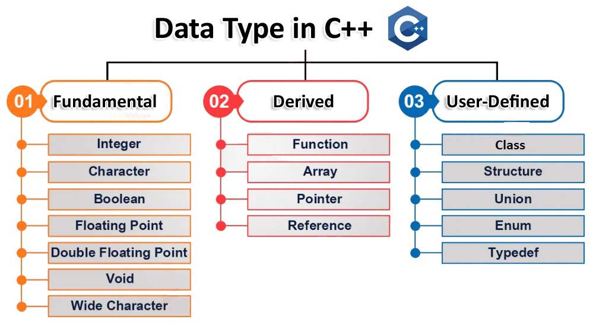

## Data Types no C++

Todas as variáveis usam data type durante sua declaração para restringir o tipo de dados que serão armazenados. Portanto, podemos dizer que os data type são usados para informar às variáveis o que elas podem armazenar ou o tipo de dados que elas podem armazenar. Sempre que uma variável é definida em C++ o compilador aloca alguma memória para essa variável com base no data type com o qual ela é declarada, cada data type requer uma quantidade diferente de memória.

O C++ suporta uma ampla variedade de data types e o programador pode selecionar as que sejam mais apropriadas as necessidades do aplicativo. Os data types especificam o tamanho e os tipos de valor a serem armazenados. No entanto, a representação de armazenamento e as instruções de máquina para manipular cada tipo de dados diferem de equipamento para equipamento, embora as instruções do C++ sejam idênticas em todas as máquinas.

Os data types que o C++ suporta:

- Primary or Built in or Fundamental data type - Data type primário, integrado ou fundamental.
- Derived data type - data type derivados dos primary ou fundamental.
- User defined data types - data types definidos pelo usuário.



Vamos analisar em detalhes cada um deles:

1. Primary ou Primitive data types: Esses data types são internos(built-in) ou predefinidos e podem ser usados diretamente pelo usuário para declarar variáveis. Por exemplo: *int*, *char*, *float*, *bool*, etc. Data types primitivos no C++ são:

- __Integer__: A key-word usada para tipos de dados integer (*inteiros*) é __int__. Os inteiros normalmente exigem 4 bytes de espaço de memória e variam de -2,147,483,648 a 2,147,483,647.

- __Character__: O data type character é usado para armazenar caracteres. A key-word usada para o tipo de dados de caractere é __char__. Character normalmente requerem 1 byte de espaço de memória e variam de -128 a 127 ou 0 a 255.

- __Boolean__: O data type boolean é usado para armazenar valores booleanos ou lógicos. Uma variável booleana pode armazenar *true* ou *false*. A key-word usada para o tipo de dados Boolean é __bool__.

- __Floating Point__: O data type floating-point é usado para armazenar valores de precisão simples ou valores decimais. A key-word usada para o tipo de dados floating point é __float__. Variáveis float normalmente requerem 4 bytes de espaço de memória.

- __Double Floating Point__: Como o nome sugere, o data type bouble floating point é usado para armazenar valores de precião duplos ou valores decimais. A key-word fos double floating point é __double__. Este data type normalmente requer 8 bytes de memória.

- __Valueless or Void__: Void significa sem valor. O tipo de dados void representa uma entidade sem valor e portanto, é usado para aquelas funções que não retornam um valor.

- __Wide Character__: O data type wide character também é um tipo de dados de caracteres, mas ele tem um tamanho maior que o tipo de dados normal de 8 bits. Representado por __wchar_t__. Geralmente tem 2 ou 4 bytes de memória.

O tamanho das variáveis pode ser diferente dos mostrados acima, dependendo do compilador e do computador que você está usando.

Para saber o número de bytes ocupado por uma variável ou data type na memória do computador usamos o operador __sizeof__. Por exemplo:

```c++
int m, x[50];
cout << sizeof(m);
```
Retorna 4 que é o número de bytes ocupado pelo data type __integer__ da variável m.

```c++
int m, x[50];
cout << sizeof(x);
```
Retorna 200 que é número de bytes ocupado pelo array integer da variável x.

O exemplo a seguir mostrará o correto número de bytes que os data types ocupam na mémoria do seu computador.

```c++
#include<iostream>
using namespace std;

int main()
{
    cout << "O tamanho de Int: " << sizeof(int) << endl;
    cout << "O tamanho de Char: " << sizeof(char) << endl;
    cout << "O tamanho de Bool: " << sizeof(bool) << endl;
    cout << "O tamanho de Float: " << sizeof(float) << endl;
    cout << "O tamanho de Double: " << sizeof(double) << endl;
    cout << "O tamanho de Wchar_t: " << sizeof(wchar_t) << endl;

    return 0;
}
```
## Prática

Dada uma String S, descubra qual dos seguintes data types básicos ela representa e seu tamanho (em bytes).
Os data types possíveis são:
1. Integer
2. Float
3. Double
4. Character

Exemplo 1.
```bash
Input:
S=a
Output:
1
Explicação:
A string claramente representa o tipo char e assim o tamanho de char é exibido
```
Exemplo 2.
```bash
Input
S=98.45685456
Output: 
8
Explanation:
A string representa um Double.
```
### Sua Tarefa

Sua tarefa é completar a função __BasicDataType__() que recebe a String S como parâmetro de entrada e exibe o tamanho (em bytes) do tipo de dados que ela representa.
Copie o código abaixo e faça a tarefa:

```c++
#include <bits/stdc++.h>
using namespace std;

class Solution {
  public:
    int BasicDataType(string s) {
        // digite aqui
    }
};

int main() {
    int t;
    cin >> t;
    while (t--) {
        string S;
        cin >> S;

        Solution ob;
        cout << ob.BasicDataType(S) << endl;
    }
}
```


____

Diferentes respostas seguem abaixo:
____

```c++
#include <bits/stdc++.h>
using namespace std;

class Solution {
  public:
    int BasicDataType(string s) {
       
        int size = s.size();
        // Se existe apenas 1 character ele será
        if(size==1) 
        {
          // Ou int ou char
            if(isdigit(s[0])) return sizeof(int);
            else return sizeof(char);
        }
        for(int i=0; i<size; i++)
        {
          // Ou float e double
            if(s[i]=='.')
            {
                if(size-1-i>=6) return sizeof(double);
                return sizeof(float);
            }
        }
        return sizeof(int);
    }      
};

int main() {
    int t;
    cin >> t;
    while (t--) {
        string S;
        cin >> S;

        Solution ob;
        cout << ob.BasicDataType(S) << endl;
    }
}
```
____

```c++
#include <bits/stdc++.h>
using namespace std;

class Solution {
  public:
    int BasicDataType(string s) {
        // Digite aqui...
        int i;
        int n=s.size();
        int char_size=1;
        int float_size=4;
        int double_size=8;
        int integer_size=4;
        // Se existe apenas um caractere significa int ou char
        if(n==1)
        {
            if(isdigit(s[0]))
            {
                return integer_size;
            }
            else
            {
                return char_size;
            }
        }
        // Ou float e double
        for(i=0;i<s.size();i++)
        {
          if(s[i]=='.')
          {
              if(n-1-i>=6)
              {
                  return double_size;
              }
              else
              {
                  return float_size;
              }
          }
        }
        // Se não for float ou double será int;
        return integer_size;
    }
};

int main() {
    int t;
    cin >> t;
    while (t--) {
        string S;
        cin >> S;

        Solution ob;
        cout << ob.BasicDataType(S) << endl;
    }
}
```
____

```c++
#include <bits/stdc++.h>
using namespace std;

class Solution {
  public:
     int BasicDataType(string s) {
     int returnFloat = 0, returnDouble = 0, returnChar = 0, floatingPointIndex;
       // digite aqui...
       
       // se o comprimento da string for 1 e não for um dígito, o data type será um char
       if (s.length() == 1 && !isdigit(s[0]))
       {
           returnChar++;
       }
       
       // passe por todos os itens na string e veja se algum deles é um ponto
       for ( int i = 0; i < s.length(); i++)
       {
           if (s[i] == '.')
           {
               floatingPointIndex = i; // defina o index do ponto para a variável floatingPointIndex
               
               // verifique se o comprimento do subarray formado pelos itens após o ponto é menor que 6, 
               // mas maior que 0, o data type é float
               if (s.length() - 1 - floatingPointIndex > 0 && s.length() - 1 - floatingPointIndex < 6) 
               {
                   returnFloat++; 
                   break;
               }
               else 
               {
                   // se o comprimento do subarray formado pelos itens após o ponto for maior que 6, 
                   // o data type será double
                   returnDouble++;
               }
           }
       }
       
      if (returnChar != 0)
      {
          return sizeof(char);
      }
      else if (returnFloat != 0)
      {
          return sizeof(float);
      }
      else if (returnDouble != 0)
      {
          return sizeof(double);
      }
      else
      {
          // se nenhum data type definido corresponder ao input, o data type será int
          return sizeof(int);
      }
    }
};

int main() {
    int t;
    cin >> t;
    while (t--) {
        string S;
        cin >> S;

        Solution ob;
        cout << ob.BasicDataType(S) << endl;
    }
}
```

