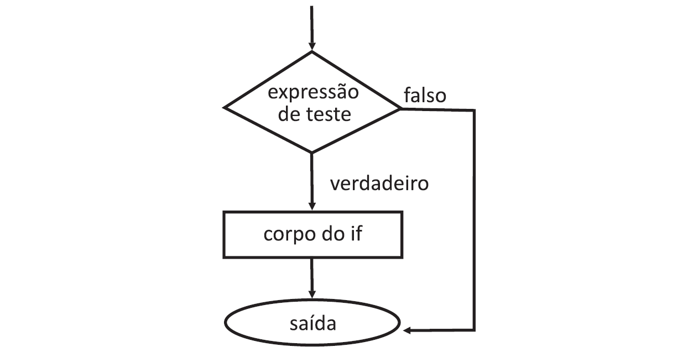
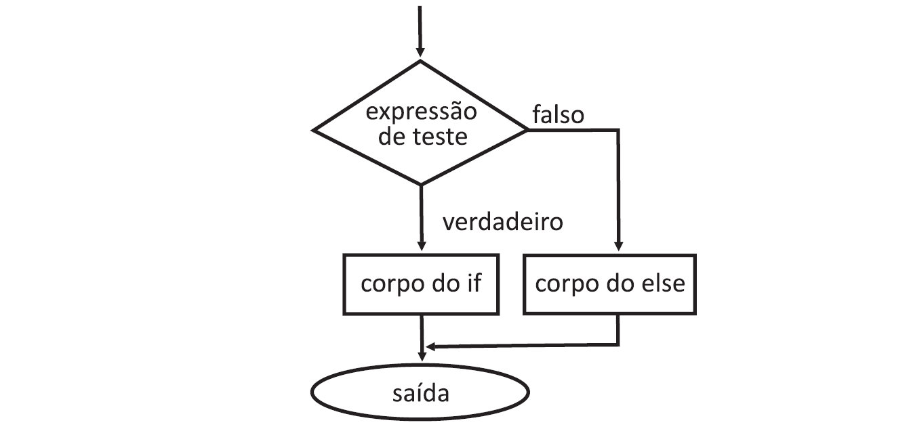
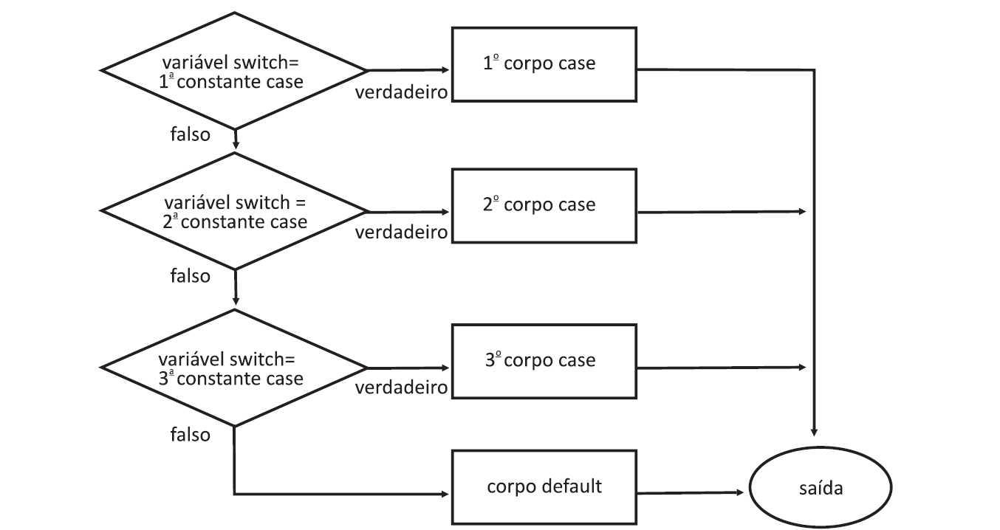
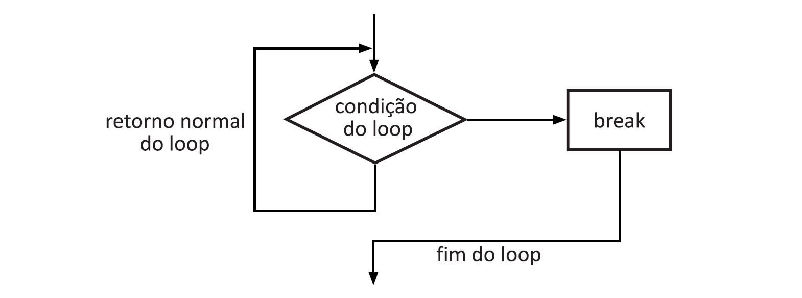
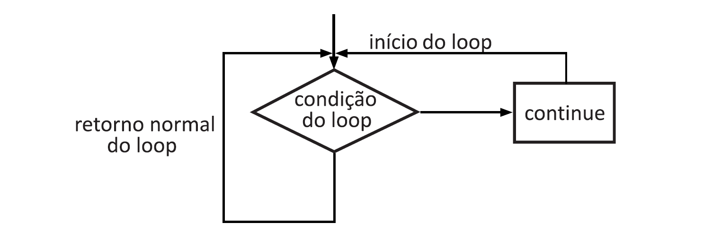

____




Por exemplo, se x ocorrer então execute y senão execute z. Também pode haver várias condições, se x ocorrer, execute p, caso contrário, se a condição y ocorrer, execute q, caso contrário, execute r.

Decisões em C++ podem ocorrer de várias formas. Dentre elas, a mais importante é a instrução *if... else*, a qual escolhe uma entre duas alternativas.

Declarações de tomada de decisão em linguagens de programação decidem a direção do fluxo de execução do programa. No C ou C++ temos as seguintes delcarções disponíveis:

1. declaração *if*
2. delcaração *if-else*
3. declaração *nested-if* - uma condição dentro da outra
4. *if-else-if*
5. declaração switch
6. declarações jump (salto)
 -  break
 -  continue 
 -  goto 
 -  return 

## Declaração if 

if é a declaração mais simples de tomada de decisão. Ele é usado para decidir se uma determinada instrução ou bloco de instruções será executado ou não, ou seja, se uma determinada condição for verdadeira, um bloco de instruções será executado, caso contrário, não.

Sintaxe

```html
if (condição)
{
  // declarações a executar
}
```
Aqui, a condição após a avaliação será verdadeira ou falsa. As declarações if aceitam valores booleanos - se o valor for verdadeiro, ele executará o bloco de instruções abaixo dele, caso contrário, não. 

Se não fornecermos as chaves { } após a condição if, então, por padrão, a instrução if considerará a primeira declaração imediatamente abaixo de seu bloco.

Exemplo:

```html
if (condição)
    declaração1;
    declaração2;

    // Se a condição for verdadeira,
    // o if executará apenas a declaração1, dentro do se bloco.
```


Exemplo:

```c++
#include<iostream>
using namespace std;

int main()
{
 int i = 10;

 if (i > 15)
 {
  cout << "i e maior do que 15";
 }
 cout << "Se a declaracao acima for falsa, me mostre.";

 return 0;
}
```
Output:

```html
Se a declaracao acima for falsa, me mostre.
```
Agora vamos ver o uso de *if* com múltiplas instruções dentro do corpo do loop.

Exemplo:

```c++
// Programa para ilustrar a operacao if
#include<iostream>
using namespace std;

int main()
{
 int n; // n define o número digitado pelo usúario
 cout << "\nDigite um valor: ";
 cin >> n;
 if (n % 3 == 0)
 {
  cout << "\nO valor digitado " << n << " e multiplo de 3" << endl;
  cout << "\nSeu resto " << n % 3  << endl << endl;
 }
  return 0;
}
```
Output:

```html
Digite um valor: 15

O valor digitado 15 e multiplo de 3

Seu resto 0
```
No programa acima testamos se o valor digitado é múltiplo de 3, com o

```html
if (n % 3 == 0)
``` 
Se a condição for verdadeira, as instruções dentro do corpo de *if* serão executadas, o que causa a exibição de que $ n $ é múltiplo de 3. Se $ n $ não for múltiplo de 3, o programa não mostrará nada. Se quisermos que o programa mostre mais alguma coisa precisamos do *else*, e é o que vamos ver logo em seguida.

____

## Declaração if... else

A declaração *if* sozinha nos diz que se uma condição for verdadeira, ela executará um bloco de instruções e, se a condição for falsa, não. Mas e se quisermos fazer outra coisa se a condição for falsa. Para isso usamos *if... else*. Podemos usar a instrução else com a instrução if para executar um bloco de código quando a condição for falsa.

Sintaxe:

```html
if (condição)
{
  // execute esse bloco se a condição for verdadeira
}
else
{
  // Sexecute esse bloco caso ela seja falsa
}
```


Exemplo:

```c++
// Programa para ilustrar a operacao do loop if... else
#include<iostream>
using namespace std;

int main()
{
  int i = 5;

  if (i < 15)
  {
    cout << "i e menor do que 15";
  }
  else
  {
    cout << "i e maior do que 15";
  }
  return 0;
}
```
Output:

```html
i e menor do que 15
```
O programa acima segue a instrução *else* já que a condição presente na instrução *if* é falsa.

No programa abaixo pedimos ao usúario dois números(n1 e n2), o programa verifica qual deles é maior e exibi o resultado da comparação. Se a condição
if for verdadeira, n1 é maior ou igual a n2. Caso contrário, no bloco else, n2 é maior.

```c++
// Programa para ilustrar a operacao do loop if... else
#include<iostream>
using namespace std;

int main()
{
  unsigned int n1, n2;

  cout << "Digite o primeiro numero: ";
  cin >> n1;
  cout << "Digite o segundo numero: ";
  cin >> n2;

  if (n1 >= n2) // teste de condição 
  {
    cout << n1 << " >= " << n2 << endl;
  }
  else
  {
    cout << n1 << " < " << n2 << endl;
  }
  return 0;
}
```
Output:

```html
Digite o primeiro numero: 5
Digite o segundo numero: 10
5 < 10
```
No programa acima, após o teste de condição, o corpo de *if* é executado caso o número digitado em n1 seja maior do que n2, se não, o corpo do bloco *else* será executado.
____

## Declaração nested-if

Um if nested é uma declaração if que é o destino de outra instrução if. As instruções *nested-if* significam uma instrução dentro de outra instrução, ou seja, podemos colocar ifs dentro de loops e ifs dentro de ifs.

Sintaxe:

```html
if (condição_1)
{
  // Execute quando a condição_1 for verdadeira

  if (condição_2)
  {
    // Execute quando a condição_2 for verdadeira
  }
}
``` 
Exemplo:

```c++
// Programa para ilustrar a operacao do loop if... else
#include<iostream>
using namespace std;

int main()
{
  int i = 10;

  if (i == 10) // Primeira condição
  {
    if (i < 15) // Nested if 
    {
      cout << "i e menor do que 15\n";
    }
    if (i < 12) // Nested if que só será executado se o if acima for verdadeiro
    {
      cout << "i e menor do que 12 tambem\n";
    }
  }
  return 0;
}
```
Output:

```html
i e menor do que 15       
i e menor do que 12 tambem
```
No exemplo acima fica claro o uso de ifs dentro de ifs, mas podemos também ter um if dentro de um loop, como no exemplo abaixo.

Exemplo:

```c++
#include<iostream>
using namespace std;

int main()
{
  unsigned long n, i;
  cout << "\nDigite um valor: ";
  cin >> n;
  for ( i = 2; i <= n/2; i++) // o loop realiza divições sucessivas por 2

    if ( n % i == 0) // se o resto é igual a 0, então n é divisivel por i
    {
      cout << n << " nao e um numero primo" << endl;
    }
     cout << n << " e um numero primo" << endl;
  return 0;
}
```
Output:

```html
Digite um valor: 5
5 e um numero primo
```
No exemplo acima usamos o loop e o if para verficar se um número é primo ou não. Para saber se n é primo, você divide n sucessivamente por 2 e verifica se o resto é 0. Se essa condição for verdadeira, n não é primo. Caso contrário, n é primo. Repare que o programa pode ser escrito de forma ligeiramente diferente com o uso de *else*. 

Com isso vamos a mais um forma de nested-if que é if com outro if e else dentro dele.

## if... else... if

Com essas declarações podemos decidir entre várias opções. As declarações if são executadas de cima para baixo. Assim que uma das condições que controlam o if for verdadeira, a instrução associada a esse if é executada e o restante da escada else-if é ignorada. Se nenhuma das condições for verdadeira, a instrução else final será executada.

Sintaxe:

```html
if (condição)
    declaração;
else if (condição)
    declaração;
    .
    .
    .
else
    declaração;
```
Exemplo:

```c++
#include<iostream>
using namespace std;

int main()
{
  int n;
  cout << "\nDigite um valor: " << endl;
  cin >> n;
  if (n == 10)
      cout << "n e 10" << endl;
  else if ( n == 15)
      cout << "n e maior ou igual a 15" << endl;
  else if (n == 20)
      cout << "n e menor ou igual a 20" << endl;
  else 
      cout << "n e diferente";
  return 0;
} 
```
Output:

```html
Digite um valor: 
5
n e diferente
```
Vamos ver um programa que solicita ao usúaria um direção, n(norte), s(sul), l(leste) e o(oeste). Inicialmente a posição é [x, y] = [0, 0]. Se for digitado 'n', ele irá para a posição [0, 1]. Em seguida, se for digitado 'o', a nova posição será [−1, 1].

Exemplo:

```c++
// Programa para ilustrar o uso de multiplas estruturas if... else... if
#include<iostream>
#include<conio.h>
using namespace std;

int main()
{
  char entrada = 'x';
  int x = 0, y = 0;

  cout << "\nDigite n(norte), s(sul), l(leste) ou o(oeste) ou Enter para sair";
  while( entrada != '\r') // move o cursor para o começo da linha
  {
    cout << "\nPosicao = [" << x << ", " << y << "]" << endl;
    cout << "\nDirecao = " << endl;
    entrada = getche(); // ler entrada
    if (entrada == 'n') // direção norte
      y++;
    else if (entrada == 's') // direção sul
      y--;
    else if (entrada == 'l') // direção leste
      x++;
    else if (entrada == 'o') // direção oeste
      x--;
  }
  return 0;
}
```
Output:

```html
Digite n(norte), s(sul), l(leste) ou o(oeste) ou Enter para sair
Posicao = [0, 0]

Direcao =
n
Posicao = [0, 1]

Direcao =
s
Posicao = [0, 0]

Direcao =
l
Posicao = [1, 0]

Direcao =
o
Posicao = [0, 0]

Direcao =
```
Inicialmente o programa assume a posição = [0, 0]. Como no exemplo, se você digitar 'n', sua posição será, [0, 1]; se você continuar com 'n' essa posição vai contiuar aumentando, [0, 2]; se você digitar 's', essa posição vai começar a voltar a zero. A mesma lógica se aplica as outras posições.
___

## Switch

A instrução *switch* avalia uma determinada expressão e, com base no valor avaliado (correspondendo a uma determinada condição), executa as instruções associadas a ela. Basicamente, ele é usado para executar diferentes ações com base em diferentes condições (casos).

Considere um problema que requeira várias decisões e que todas as decisões dependam do valor da mesma variável. Em tal situação, você pode utilizar o *switch* em vez das outras construções vistas anteriormente (if... else ou else... if ).

Em uma instrução switch, o “valor case” pode ser do tipo “char” e “int”.
A seguir estão algumas das regras ao usar a instrução switch:

- Pode haver um ou N números de casos.
- Os valores nos casos devem ser exclusivos.
- Cada instrução do case pode ter uma instrução break. É opcional.

Sintaxe:

```html
switch (expressão)
{
  case valor1;  declaração_1; break;
  case valor2;  declaração_2; break;
  ...
  ...
  ...
  case valor_n; declaração_n; break;

  default:      default declaração;
}
```


Observe que, se não ocorre um casamento entre o valor da variável switch e uma das constantes case, o controle vai para a primeira instrução seguindo o case.

Exemplo:

```c++
// Programa para ilustrar o uso de switch
#include<iostream>
#include<conio.h>
using namespace std;

int main()
{
  char entrada = 'x';
  cout << "\nDigite n(norte), s(sul), l(leste), o(oeste) ou Enter para sair: ";

  entrada = getche(); // entrada do usúario
  switch(entrada)
  {
    case 'n':
    cout << "\nVoce escolheu a direcao Norte ";
    break;
    case 's':
    cout << "\nVoce escolheu a direcao Sul ";
    break;
    case 'l':
    cout << "\nVoce escolheu a direcao Leste ";
    break;
    case 'o':
    cout << "\nVoce escolheu a direcao Oeste ";
    break;
    case '\r':
    cout << "\nVoce escolheu sair do programa ";
    break;
    default:
    cout << "\nVoce escolheu a opcao errada ";
    break;
  }
  return 0;
}
```
Output:

```html
Digite n(norte), s(sul), l(leste), o(oeste) ouEnter para sair: n
Voce escolheu a direcao Norte
```
Quando uma constante casa com o valor da variável switch, as instruções seguintes à instrução case são executadas até que o break seja encontrado. Quando o break é encontrado, o controle do programa vai para primeira instrução após a instrução switch. Se não existe o break, o controle vai para a(s) próxima(s) instrução(ões) case.
____

## Declarações jump

Essas instruções são usadas em C ou C++ para o fluxo incondicional de controle em todas as funções de um programa. Eles suportam quatro tipos de instruções de salto:

### break

Esta instrução de controle de loop é usada para encerrar o loop da mesma forma que faz em uma instrução switch. Assim que a instrução break é encontrada de dentro de um loop, as iterações param ali e o controle retorna do loop imediatamente para a primeira instrução após o loop. 

Sintaxe:

```html
break;
```


Basicamente, as instruções break são usadas em situações em que não temos certeza sobre o número real de iterações do loop ou queremos encerrar o loop com base em alguma condição.

Exemplo:

```c++
// Programa para mostrar o uso do break 
#include<iostream>
using namespace std;

void elemento(int arr[], int size, int key)
{
    // loop para percorrer a matriz e procurar a chave
    for (int i = 0; i < size; i++)
    {
        if (arr[i] == key)
        {
            cout << "Elemento achado na posicao: ";
            cout << (i + 1);
            break;
        }
    }
}

int main ()
{
    int arr[] = {1, 2, 3, 4, 5, 6, 7, 8};
    int n = 8; // número de elementos
    int key = 5; // chave a ser procurada

    // chamando a função para achar a chave
    elemento(arr, n, key);
    return 0;
}
```
Output:

```html
Elemento achado na posicao: 5
```
_____
### continue

A instrução continue é oposta à instrução break, em vez de encerrar o loop, ela força a execução da próxima iteração do loop.

Como o nome sugere, a instrução continue força o loop a continuar ou executar a próxima iteração. Quando a instrução é executada no loop, o código dentro do loop após a instrução será ignorado e a próxima iteração do loop começará.

Sintaxe:

```html
continue;
```


Exemplo:

```c++
// Programa para mostrar o uso da declaração continue
#include<iostream>
using namespace std;

int main()
{
    // loop de 1 até 12
    for (int i = 1; i <= 12; i++)
    {
        // se i for igual a 5, continue a iteração
        if (i == 5)
            continue;
        // se não print a valor de i    
        else
        cout << i << " ";
    }
    return 0;
}
```
Output:

```html
1 2 3 4 6 7 8 9 10 11 12
```
No exemplo abaixo vamos usar o *continue para voltar ao inicio de loop*. O programa vai calcular a faixa $ y = f(x) $. Vamos calcular a função $ f(x) = sqrt(x^2 - 4) $ para valores de $ x $ na faixa mín e máx; ou seja, o usuário é solicitado a entrar com dois números do tipo inteiro mín (valor mínimo) e máx (valor máximo) que serão computados para função $ f(x) $. Teremos um if para os valores na faixa -1, 1, que resultam em valores complexos. 

Exemplo:

```c++
// Programa para mostrar o uso da declaração continue
#include<iostream>
#include<iomanip>
#include<math.h>
using namespace std;

int main()
{
    int min, max;
    double x, y;
    cout << "\nDigite o valor min de f(x) = ";
    cin >> min;
    cout << "\nDigite o valor max de f(x) = ";
    cin >> max;
    cout << "\nValor de x " << setw(10) << "Valor de f(x) " << endl;
    
    for (int i = min; i <= max; i++) // loop de valores min e max
    {
        if (i > -2 && i < 2) // faixa de valores complexos
        {
            cout << setw(11) << i << setw(25) << "Valor nao calculado" << endl;
        continue; // voltar ao loop 
        }
    x = (double) i;
    y = sqrt(x*x - 4);
    cout << setw(11) << x << setw(13) << y << endl;
    }
    return 0;
}
```
Output:

```html
Digite o valor min de f(x) = -10

Digite o valor max de f(x) = 10

Valor de x Valor de f(x)
        -10      9.79796
         -9      8.77496
         -8      7.74597
         -7       6.7082
         -6      5.65685
         -5      4.58258
         -4       3.4641
         -3      2.23607
         -2            0
         -1      Valor nao calculado
          0      Valor nao calculado
          1      Valor nao calculado
          2            0
          3      2.23607
          4       3.4641
          5      4.58258
          6      5.65685
          7       6.7082
          8      7.74597
          9      8.77496
         10      9.79796
```
____

### goto 

A instrução goto em C/C++ também conhecida como instrução jump incondicional pode ser usada para pular de um ponto para outro dentro de uma função.

Sintaxe:

```html
// Podemos usá-lo de duas forma

Sintaxe_1         |   Sintaxe_2
----------------------------
declaração goto;  |    label:  
.                 |    .
.                 |    .
.                 |    .
label:            |    declaração goto;
```
Na sintaxe acima, a primeira linha diz ao compilador para ir ou pular para a instrução marcada como um rótulo. Aqui, um rótulo é um identificador definido pelo usuário que indica a instrução de destino. A instrução imediatamente seguida de 'label:' é a instrução de destino. O 'label:' também pode aparecer antes da instrução 'declaração goto;' na sintaxe acima.

Exemplo:

Sintaxe_1:

Suponha que precisamos escrever um programa em que precisamos verificar se um número é par ou não e fazer o print de acordo usando a instrução goto. O programa abaixo explica como fazer isso:

```c++
// Programa para demonstrar o uso da declaração goto
#include <iostream>
using namespace std;

void Primo_Par(int num)
{
	if (num % 2 == 0)
	// pule para par
		goto par;
	else
	// pule para impar
		goto impar;
par:
	cout << num << " e par";
	// retorn se par
	return;
impar:
	cout << num << " e impar";
    // return se impar
    return;
}
// Teste
int main()
{
	int num = 15;
	Primo_Par(num);
	return 0;
}
```
Output:

```
15 e impar
```
Sintaxe_2:

Nesse caso, veremos uma situação semelhante à mostrada na Sintaxe_1 acima. Suponha que precisamos escrever um programa que imprima números de 1 a 10 usando a instrução goto. O programa abaixo explica como fazer isso.

```c++
// Programa para demonstrar o uso da declaração goto
#include <iostream>
using namespace std;

// função que faz o print de 1 até 15
void print_Numeros()
{
	int n = 1;
label:
	cout << n << " ";
	n++;
	if (n <= 15)
		goto label;
}

// Teste a função acima
int main()
{
	print_Numeros();
	return 0;
}
```
Output:

```
1 2 3 4 5 6 7 8 9 10 11 12 13 14 15
```
Considerações:

- O uso da instrução goto é altamente desencorajado, pois torna a lógica do programa muito complexa.
- o uso de goto torna a tarefa de analisar e verificar a correção dos programas (particularmente aqueles que envolvem loops) muito difícil.
- Use of goto can be simply avoided using break and continue statements.
____

### return

O retorno em C ou C++ retorna o fluxo da execução para a função de onde foi chamada. Esta instrução não precisa obrigatoriamente de nenhuma instrução condicional. Assim que a instrução é executada, o fluxo do programa para imediatamente e retorna o controle de onde foi chamado. A instrução return pode ou não retornar nada para uma função void, mas para uma função não void, um valor de retorno deve ser retornado.

Sintaxe:

```html
return[expressão];
```
Exemplo:

```c++
// Programa para demonstrar o uso da declaração goto
#include <iostream>
using namespace std;

// função para calcular suma non-void
int sum(int a, int b)
{
    int s1 = a + b;
    return s1;
}
// função void para fazer o print
void print_Numeros(int s2)
{
    cout << "A some e: " << s2;
    return;
}   

// Teste a função acima
int main()
{
	int num1 = 10;
    int num2 = 20;
    int soma_de = sum(num1, num2);
    print_Numeros(soma_de);
	return 0;
}
```
Output:

```html
A some e: 30
```
____

Por favor, escreva para o email: (siteaprendacpp@gmail.com) se você encontrar algo incorreto ou se quiser compartilhar mais informações sobre o tópico discutido acima.