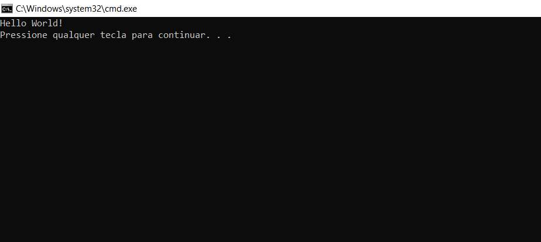

## Nosso Primeiro Porgrama em C++ - Hello World

C++ é uma linguagem de programação orientada a objetos amplamente utilizada e é bastante fácil de entender. Aprender C++ pode ser simplificado em:

- Escrevendo seu programa em um editor de texto e salvando-o com a extensão correta (.CPP, .C, .CP).
- Compilar seu programa usando um compilador ou IDE online.
- Compreender as terminologias básicas.

O programa “Hello World” é o primeiro passo para aprender qualquer linguagem de programação e também é um dos programas mais simples que você pode aprender. Tudo que temos que fazer é exibir a messagem Hello World na tela: 

```c++
// Programa em C++ que exibe Hello World

//Header files para funções input e output
#include<iostream>
using namespace std;

// A função main() aqui começa a execução do programa 
int main()
{
  cout << "Hello World";
  // print Hello World
  return 0;
}
```
__Resultado__:



Vamos agora entender cada linha e as terminologias do programa acima:

1. __// Programa em C++ que exibe Hello World__: Esta linha é um comentário. Um comentário é usado para exibir informações adicionais sobre o programa, ele não contém nenhuma lógica de programação. Quando um comentário é encontrado por um compilador ele simplesmento o ignora. Qualquer parte do programa que começe com // ou / * * / em C++ é um comentário.
 
2. __#include__: Em C++ todas as linhas que começam com o sinal __(#)__ são chamadas de diretivas e são processadas por um pré-processador que é um programa chamado pelo compilador. A diretiva __#include__ diz ao compilador para incluir um arquivo e __#include iostream__ diz ao compilador para incluir o arquivo *iostream* que contém declarações de todas as funções input/output.

3. __using namespace std__: É usado para importar a totalidade no *namespace std* para o namespace atual do programa. Esta prática geralmente é considera ruim, porque quando importamos um namespace estamos trazendo todas as definições type dentro do escopo atual. A alternativa a esta declaração é especificar o namespace ao qual o identificador pertence usando o operador (::) cada vez que declaramos um tipo. Por exemplo:

```c++
using std::cout;
```
4. __int main()__: Esta parte do código é usada para declarar uma função chamada *main()* que retorna dados do tipo integer. Uma função é um grupo de statements que são designados para uma tarefa específica. A execução de cada programa C++ começa com a função main(), não importa onde a função esteja localizada no programa. Portanto, todo programa C++ deve ter uma função main().

5. __{ }__: As chaves de abertura *{* indicam o início da função main e as chaves de fechamento *}* indicam o fim da função main. Tudo entre eles compreende a estrutura da função main.

6. __cout << "Hello World";__: Esta parte diz ao compilador para exibir a mensagem “Hello World” na tela. No C++ está linha é um statement, um ponto e vírgula é usado para encerrar o statement. Tudo seguido pelo caractere *<<* é exibido no dispositivo de saída.

7. __return 0;__: Isso também é um statement. Usamos ele para retornar um valor de uma função e também terminar a função. 

8. __Indentação__: Como você pode ver, o statement *cout* e *return* foram recuados ou movidos para o lado direito,fazemos isso para deixar o programa mais legível. Em um programa como Hello World, não tem muita relevância, mas à medida que os programas se tornam mais complexos, deixamos o programa mais compreensível, menos propenso a erros. 

Pontos importantes a serem observados ao escrever um programa C++:

- Sempre inclua os arquivos de cabeçalho necessários para a execução correta das funções. Por exemplo, __iostream__ deve ser incluído para usar __std::cin__ e __std::cout__.

- A execução do código começa a partir da função main().

- É uma boa prática usar identação e comentários para facilitar o entendimento do programa.

- __cout__ é usado para o print de statements e __cin__ é usado para receber *inputs*.

___

## Prática 

No seu editor de código ou ide faça o seguinte exercício:

Escreve um programa que exibe __Hello World__.

Exemplo 1.

```s
Input: 
No Input

Output:
Hello World
```
### Sua Tarefa

Copie o código abaixo e faça um output do __"Hello World"__:

```c++
#include<iostream>
using namespace std;

int main()
{
  // Digite aqui
  return 0;
}
```

```c++
#include<iostream>
using namespace std;

int main()
{
  cout << "Hello World";
  return 0;
}
```
