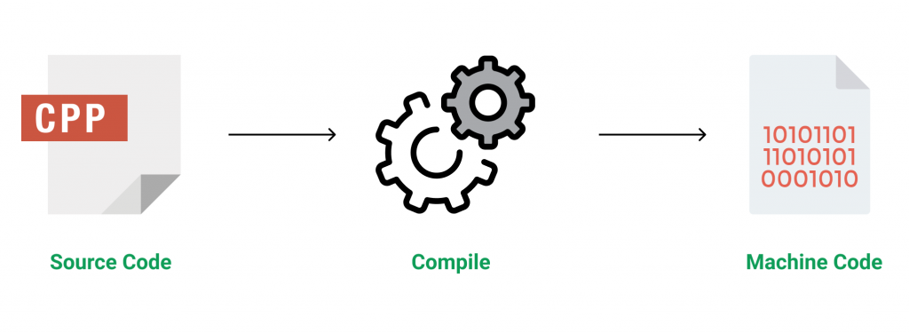

## Introduction to C++ Programming Language

C++ is a general-purpose programming language that was developed as an enhancement of the C language to include object-oriented paradigm. It is an imperative and a compiled language.

C++ is a middle-level language rendering it the advantage of programming low-level (drivers, kernels) and even higher-level applications (games, GUI, desktop apps etc.). The basic syntax and code structure of both C and C++ are the same.

Some of the features & key-points to note about the programming language are as follows:

- __Simple__: It is a simple language in the sense that programs can be broken down into logical units and parts, has a rich library support and a variety of data-types.