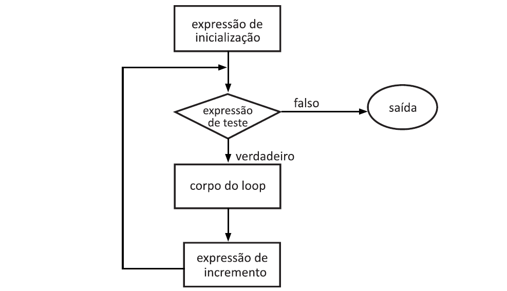
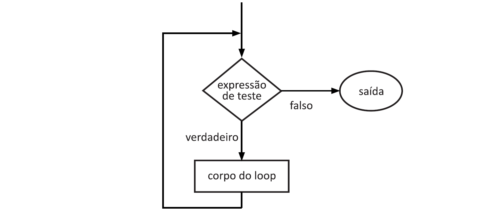
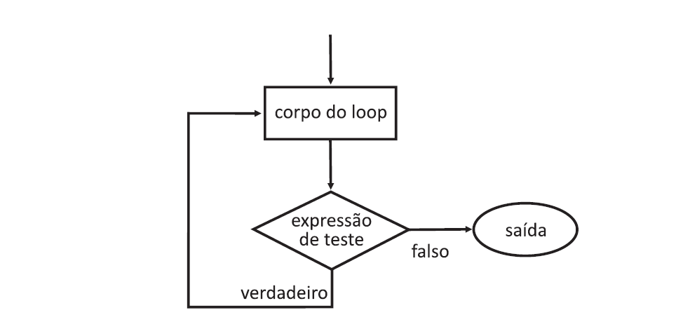

____



Na programação, às vezes é necessário realizar alguma operação mais de uma vez ou (digamos) n número de vezes. Os loops são usados quando precisamos executar repetidamente um bloco de instruções.

Vamos supor que queremos fazer o print do "Hello World" 5 vezes, existem duas formas de fazermos isso:

__Método Manual ou Método Iterativo__

Manualmente, teriamos que escrever a instrução cout 5 vezes. Em outro caso poderiamos ter que escrever 10, 15 ou mais vezes, o que seria bem repetitivo e completamente ineficiente. Para que isso não seja necessário, os loops foram criados.

```c++
#include<iostream>
using std::cout;

int main()
{
  cout << "Hello World\n";
  cout << "Hello World\n";
  cout << "Hello World\n";
  cout << "Hello World\n";
  cout << "Hello World\n";
  return 0;
}
```
Output

```html
Hello World
Hello World
Hello World
Hello World
Hello World
```
__Loops__

Usando o Loop, a instrução precisa ser escrita apenas uma vez e o loop será executado o números de vezes que determinamos, neste caso 5 vezes, conforme mostrado abaixo. Na programação, um loop é uma sequência de instruções que é repetida até que uma determinada condição seja alcançada.

```c++
#include<iostream>
using std::cout;

int main()
{
  for (int i = 1; i <= 5; i++)
      cout << "Hello World\n";
  return 0;
}
```
Output

```html
Hello World
Hello World
Hello World
Hello World
Hello World
```

### Os dois tipo de loops

1. Loops controlados por entrada: Neste tipo de loop, a condição de teste é verificada antes de entrar no corpo do loop. __For Loop__ e __While Loop__ são loops controlados por entrada.
   
2. Loops controlados por saída: Neste tipo de loop a condição de teste é verificada ou avaliada no final do corpo do loop. Portanto, o corpo do loop será executado pelo menos uma vez, independentemente de a condição de teste ser verdadeira ou falsa. o loop __Do-While__ é um loop controlado por saída.

|                     |                                                                                               |   |
|:-------------------:|-----------------------------------------------------------------------------------------------|---|
|   **1. loop While**  |               primeiro verifica a condição, depois, segue com a execução(corpo).              |   |
|   **2. loop For**    | primeiro inicializa, depois, condição verificada, prossegue com a execução (corpo), atualiza. |   |
| **3. loop Do-While** |              em primeiro lugar, execute o corpo, em seguida, verifique a condição             |   |

## Loop for

O loop for executa uma seção de código um número fixo de vezes. Geralmente, é utilizado quando se sabe antecipadamente (antes de entrar no loop) o número de iterações que um determinado trecho de código será executado, em outras palavras, quantas vezes a seção de código deverá ser executada.

Sintaxe:

```html
for (expressão de inicialização; expressão de teste; atualize a expressão)
{
  // corpo do loop
  // declarações que queremos executar
}
```
Exemplo:

```html
for (int i = 0; i < n; i++)
{
  // corpo
}
```
Observe que a expressão de inicialização é executada apenas uma vez, enquanto a expressão de teste é executada toda vez que o corpo do loop é executado. Já a expressão atualize ou incremento atualiza a variável do loop após cada execução do corpo do loop, enquanto a condição de teste for avaliada como verdadeira. 

- __Expressão de inicialização__: Nesta expressão, temos que inicializar o contador de loops com algum valor. por exemplo: int i = 1;
  
- __Expressão de teste__: Nesta expressão, temos que testar a condição. Se a condição for verdadeira, executaremos o corpo do loop e iremos atualizar a expressão, caso contrário, sairemos do loop. por exemplo: i <= 10;
  
- __Expressão de incremento(atualize)__: Depois de executar o corpo do loop, esta expressão incrementa/diminui a variável do loop em algum valor. por exemplo: i++; 



Veja um exemplo abaixo.

Exemplo:

```c++
// Programa para ilustrar a operacao do loop for
#include<iostream>
using namespace std;

int main()
{
  int i; // variável do loop
  int n; // variável limite no número de iterações no loop
  cout << "Digite um valor: ";
  cin >> n;
  for (int i = 1; i <= n; i++) // executa o loop de 1 até n
      cout << "Valor do quadrado " << i << " = " << i * i << endl;
  return 0; 
}
```
Output

```html
Digite um valor: 5
Valor do quadrado 1 = 1
Valor do quadrado 2 = 4
Valor do quadrado 3 = 9
Valor do quadrado 4 = 16
Valor do quadrado 5 = 25
```
No exemplo acima pedimos ao usúario para digitar um valor inteiro (n), em seguinda o programa faz n iterações usando o loop for. A cada iteração (expressão de teste) o programa calcula o quadrado de i. 

Observe que o loop for contém uma única instrução, calcular o quadrado de i. No entanto, temos casos em que mais de uma instrução pode ser dada no corpo do loop. Nesse caso, múltiplas instruções devem ser delimitadas por chaves {}. Veja um exemplo.

Exemplo:

```c++
#include<iostream>
#include<iomanip>
using namespace std;

int main()
{
  int i; // variável do loop
  int n; // variável limite no número de iterações no loop
  cout << "Digite um valor: ";
  cin >> n;
  cout << "\nValor" << setw(5) << " Quadrado" << endl;
  for (int i = 1; i <= n; i++) // executa o loop de 1 até n
      {
        cout << setw(3) << i; // exibe o valor de i
        int n2 = i * i; // variável 2 que armazena o quadrado de n
        cout << setw(7) << n2 << endl; // exibe o quadrado de i = i * i
      }
  return 0; 
}
```
Output:

```html
Digite um valor: 5

Valor Quadrado
  1      1
  2      4
  3      9
  4     16
  5     25
```
Nos programas anteriores, você utilizou a expressão de incremento para incrementar uma variável de controle. Contudo, ela também pode decrementar (em vez de incrementar) a variável de um loop, como destacado no exemplo a seguir.

Exemplo:

```c++
#include<iostream>
using namespace std;

int main()
{
  unsigned int n; // variável do loop
  unsigned int fatorial = 1; // 
  cout << "Digite um valor: ";
  cin >> n;
  for (int i = n; i > 0; i--) // executa o loop de 1 até n
   fatorial *= i;
   cout << "O fatorial de " << n << " = " << fatorial << endl;
  return 0; 
}
```
____

## Loop while

Ao estudar o loop for vimos que o número de iterações é conhecido de antemão, ou seja, o número de vezes que o corpo do loop é necessário para ser executado é conhecido por nós. Já o while loops são usados em situações em que não sabemos o número exato de iterações do loop de antemão. A execução do loop é encerrada com base nas condições de teste. Ou seja, uma condição é checada e, enquanto ela for verdadeira, o corpo do loop é executado.

Já afirmamos que um loop consiste principalmente em três instruções – expressão de inicialização, expressão de teste e expressão de incremento. A sintaxe dos três loops – For, while e do while difere principalmente na colocação dessas três instruções.

Sintaxe:

```html
expressão de inicialização;
while (expressão de teste)
{
  
  // declarações

  expressão de incremento ou atualização;
}
```


Exemplo:

```c++
// Programa para ilustrar a operacao do loop while
#include<iostream>
using namespace std;

int main()
{
  // expressão de inicializão
  int i = 1;

  // expressaõ de teste
  while (i < 6)
  {
    cout << "Hello World!\n";

    // expressão de atualização
    i++;
  }
  return 0;
}
```
Output

```html
Hello World!
Hello World!
Hello World!
Hello World!
Hello World!
```
Note que a expressão de atualização é usada para terminar o loop, quando i for igual a 5 a condição foi satisfeita e o loop deve terminar, caso o contrário, o loop seguirá indefinidamente.

Neste outro exemplo, o programa solicita que o usuário digite o número 0 para encerrar o loop, enquanto isso não ocorre, o programa fica em loop, aguardando a entrada de outro número.

Exemplo:

```c++
// Programa para ilustrar a operacao do loop while
#include<iostream>
using namespace std;

int main()
{

  int n = 1; // inicializar com n maior que 0 ou n!= 0

  cout << "Digite o numero 0 para encerrar o programa: \n";
  while ( n!= 0) // execute o loop até que n = 0
  cin >> n;
  cout << "Voce digitou " << n << " e acabou o loop\n";
  return 0;
}
```
Output:

```html
Digite o numero 0 para encerrar o programa:
2
4
8
123456
2569
-56
-80
0
Voce digitou 0 e acabou o loop
```
Podemos ainda usar o loop while para descobrir o fatorial de cada número até n, veja o exemplo abaixo:

```c++
#include<iostream>
#include<iomanip>
using namespace std;

int main()
{
    int i = 1; // define e inicializa a variável de loop
    int n; // define o número de iterações do loop
    int fatorial = 1; // define a variável fatorial
    cout << "Digite um valor: ";
    cin >> n;
    cout << "\nValor" << setw(5) << " Fatorial" << endl;
    while(i <= n) // loop de 1 até a n
    {
        cout << setw(3) << i;
        fatorial *= i; // Calcula o fatorial de n
        cout << setw(7) << fatorial << endl;
        ++i;
    }
    return 0;
}
```
Output:

```html
Digite um valor: 5

Valor Fatorial
  1      1
  2      2
  3      6
  4     24
  5    120
```
____

## Loop do while

Nos loops do-while, também a execução do loop é encerrada com base nas condições de teste. A principal diferença entre um loop do-while e o loop while está no fato de que a condição é testada no final do corpo do loop, ou seja, o loop do-while é controlado por saída enquanto os outros dois loops são controlados por entrada.

Note que existem situações em que é necessário que o loop seja executado pelo menos uma vez, indepedente do teste inicial. Nesse caso, a expressão de teste deve ser colocado no fim do loop, e, portanto, deve-se usar o loop do-while.

Sintaxe:

```html
expressaõ de inicialização
do
{
  // declarações

  atualize a expressão
} while (expressão de teste);
```


Exemplo:

```c++
#include<iostream>
using namespace std;

int main()
{
    int i = 2; // expressão de inicialização

    do
    {
        //corpo do loop
        cout << "Hello World";
        
        // expressão de incremento
        i++;

    } while (i < 1); // expressão de teste
    
    return 0;
}
```
Output

```html
Hello World
```
No programa acima, a condição de teste (i < 1) é avaliada como falsa. Mas ainda assim como o loop é controlado por saída, o corpo do loop será executado uma vez.

Abaixo temos um exemplo em que após duas operações de cálculo, pedimos ao usúario se ele deseja continuar, se sim, usaremos o while para voltar ao loop, se não, o programa termina. Note também que as instruções dentro do corpo de 'do' será executada pelo menos uma vez.

Exemplo:

```c++
#include<iostream>
#include<math.h>
using namespace std;

int main()
{
    int i = 1; // valor inicial da variável de loop
    int n; // definine o número de iterações do loop
    char entrada; // variável de sim ou não
    do // loop de 1 até n
    {
        cout << "\nDigite um valor: ";
        cin >> n;
            cout << "\nQuadrado de " << n << " = " << n * n << endl;
            cout << "\nRaiz de " << n << " = " << sqrt(n) << endl;
        cout << "\nDeseja repitir: sim ou nao ? (s/n) ";
        cin >> entrada;
    }   while ( entrada != 'n');

    return 0;
}
```
Output:

```html
Digite um valor: 5

Quadrado de 5 = 25

Raiz de 5 = 2.23607

Deseja repitir: sim ou nao ? (s/n) s

Digite um valor: 25

Quadrado de 25 = 625

Raiz de 25 = 5      

Deseja repitir: sim ou nao ? (s/n) n
```
____

### E se tivermos um loop infinito ?

Um loop infinito é um pedaço do programa que não possui uma saída funcional o que faz com que ele se repita indefinidamente. Um loop infinito ocorre quando uma condição é sempre avaliada como verdadeira. Normalmente, isso é um erro.

Loop infinito com for:

```c++
#include<iostream>
using namespace std;

int main()
{
  int i;

  for (;;) // expressão em branco
  {
     cout << "Esse loop continuara indefinidamente.\n";
  }
  return 0;
}
```
Output

```html
Esse loop continuara indefinidamente.
Esse loop continuara indefinidamente.
Esse loop continuara indefinidamente.
```
No exemplo acima teremos um loop infinito porque todas as expressões estão em branco.

____

### Pontos Importantes

- Use o loop ***for*** quando um número de iterações é conhecido de antemão, ou seja, o número de vezes que o corpo do loop precisa ser executado é conhecido.

- Use loop ***while*** quando o número exato de iterações não é conhecido, mas a condição de término do loop é conhecida.

- Use o loop ***do-while*** se o programa precisa ser executado pelo menos uma vez como nos programas usados em menus.

_____

Por favor, escreva para o email: (siteaprendacpp@gmail.com) se você encontrar algo incorreto ou se quiser compartilhar mais informações sobre o tópico discutido acima.


