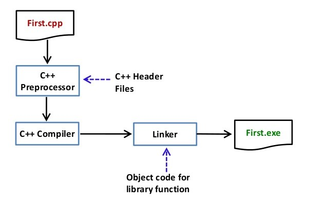

____

## Conceitos Básicos dos Pré-Processadores



Você pode ver as etapas intermediárias no diagrama acima: o código fonte escrito pelo programador é armazenado primeiro em um arquivo, podemos chama-lá de “programa.c”, este arquivo é então processado por pré-processadores e um arquivo de código fonte expandido é gerado chamado “programa.i”. Depois, este arquivo expandido é compilado pelo compilador e um arquivo de código objeto é gerado chamado “programa.obj”. Por fim, o vinculador vincula esse arquivo de código objeto ao código objeto das funções da biblioteca para gerar o arquivo executável “programa.exe”.

Os programas feitos para os pré-processadores fornecem diretivas de que dizem ao compilador para pré-processar o código-fonte antes de ele ser compilado. Todas essas diretivas de pré-processador começam com um símbolo '#' (hash). O símbolo '#' indica que qualquer instrução que comece com um '#' irá para o programa do pré-processador para ser executada. Exemplos de algumas diretivas de pré-processador são: *#include*, *#define*, *#ifndef*, etc. Lembre-se de que o símbolo '#' fornece apenas um caminho para o pré-processador, e um comando como include é processado pelo programa do pré-processador. Por exemplo, #include incluirá código extra em seu programa. Podemos colocar essas diretivas de pré-processador em qualquer lugar do nosso programa.

### Os quatro tipos principais de diretivas dos pré-processadores

1. Macros

2. Inclusão de arquivo

3. Compilação Condicional

4. Outras diretivas

Vamos aprender cada uma delas em detalhes.

### 1. Macros

Macros são partes de um código em um programa que recebe algum nome. Sempre que esse nome é encontrado pelo compilador, o compilador substitui o nome pela parte real do código. A diretiva ‘*#define*’ é usada para definir uma macro. Vamos agora entender a definição de macro com a ajuda de um programa:

```c++
#include<iostream>

// definição da macro
#define LIMITE 5
int main()
{
  // Criando um loop com limite 5
  for (int i = 0; i < LIMITE; i++){
    std:: cout << i << "\n";
  }
  return 0;
}
```
Output:
```python
0
1
2
3
4
```
No programa acima, quando o compilador executa a palavra *LIMITE*, ele a substitui com o número 5. Dessa forma, A palavra 'LIMITE' na definição das macros é chamada de *macro template* e o número '5' é a *macro expansion*.



### 1.2 Macros com Argumentos

Também podemos passar argumentos ou parâmetros para as macros, elas funcionam de forma similar as funções no C++. Vamos entender com um programa:

```c++
#include<iostream>

// macros com parâmetros
#define AREA(l, b) (l * b)
int main()
{
  int l1 = 10, l2 = 5, area;

  area = AREA(l1, l2);

  std::cout << "Area do retangulo: " << area;

  return 0;
}
```
Output:

```python
Area do retangulo: 50
```
Podemos ver no programa acima que sempre que o compilador encontra AREA(l, b) ele a substitui pela instrução (l * b). Não apenas isso, mas os valores passados para o modelo de macro AREA(l, b) também serão substituídos na instrução (l * b). Portanto, AREA(10, 5) será igual a 10 * 5.

### 2. Inclusão de arquivo

Esse tipo de diretiva de pré-processador informa ao compilador para incluir um arquivo no código-fonte. Existem dois tipos de arquivos que podem ser incluídos pelo usuário no programa:

### 2.1 Header Files or Arquivos de Cabeçalho:

Esses arquivos contêm definições de funções pré-definidas como *printf()*, *scanf()*, etc. Diferentes funções podems ser declaradas em diferentes header files. Por exemplo, as funções padrão de input e output estão no 'iostream', enquanto as funções que executam operações de string estão no arquivo 'string'.

Sintaxe:

```python
#include<nome_do_arquivo>
```
Os colchetes '<' e '>' dizem ao compilador para procurar o arquivo no diretório do padrão.

### 2.2 Arquivos Definidos Pelo Usuário

Quando um programa se torna muito grande, é uma boa prática dividi-lo em arquivos menores e incluí-los sempre que necessário. Esses tipos de arquivos são arquivos definidos pelo usuário. Assim, esses arquivos podem ser incluídos como:

```python
#include"nomedoarquivo"
```
As aspas "" dizem ao compilador para procurar o arquivo no diretório atual do programa.

### 3. Compilação Condicional

As diretivas de compilação condicional são um tipo de diretiva que ajuda a compilar uma parte específica do programa ou pular a compilação de alguma parte específica do programa com base em algumas condições. Isso pode ser feito com a ajuda dos dois comandos de pré-processamento '***ifdef***' e '***endif***'.

Sintaxe

```python
#ifdef nome_da_macro
  declaração1;
  declaração2;
  declaração3;
  .
  .
  .
  declaraçãoN;
#endif
```
Se a macro com o nome 'nome_da_macro' estiver definida, o block de declarações será executado normalmente mas, se ela não estiver definida o compilador simplesmente irá ignorar esse block de declarações.

### 4. Outras diretivas

Além das diretivas discutidas acima, existem outros duas direivas que não são costumeiramente usadas.

### 4.1 #undef

A diretiva #undef é usada para *indefinir* uma macro existente. Podemos usa-lá da seguinte forma:

```c++
#undef LIMITE
```
Se você usar essa declaração a macro LIMITE será indefinida. Assim, toda declaração "#ifdef LIMITE, #define LIMITE" serão definidas como falsas.

### 4.2 #pragma Directive

Esta diretiva é uma diretiva de propósito especial e é usada para ativar ou desativar alguns recursos. Estes tipos de diretivas são *compiler-specific*, ou seja, elas variam de compilador para compilador. Algumas das diretivas #pragma são discutidas abaixo:

### 4.2.1 #pragma startup and #pragma exit

Essas diretivas nos ajudam a especificar as funções que são necessárias serem executadas antes que o programa inicie, ou seja, antes que o controle passe para a função main() ou, imediatamente antes do programa ser finalizado, antes do controle voltar para main().



Para mais detalhes para os compiladores GCC [Acesse](https://gcc.gnu.org/onlinedocs/gcc/Pragmas.html), note também que para o compilador gcc não é recomendado o uso de #pragmas, veja [Function Attributes](https://gcc.gnu.org/onlinedocs/gcc/Function-Attributes.html#Function-Attributes).

```c++
#include<bits/stdc++.h>
using namespace std;

void func1();
void func2();

#pragma startup func1
#pragma exit func2

void func1()
{
  // A func1 será exibida primeiro
  cout << "Mostre func1()\n";
}

void func2()
{
  // A func2 será exibida depois de main()
  cout << "Exit func2()\n";
}

int main()
{
  void func1();
  void func2();
  cout << "Mostre main()\n";

  return 0;
}
```
Output:

```python
Mostre func1()
Mostre main()
Exit func2()
```
Nos compiladores GCC teremos o output abaixo:

```python
Mostre main()
```
Isso acontece porque o GCC não suporta a diretiva #pragma startup or exit, [veja quais pragmas o gcc suporta](https://gcc.gnu.org/onlinedocs/gcc/Pragmas.html).

No entanto, você pode usar o código abaixo para os compiladores GCC.

```c++
#include <iostream>
using namespace std;

void func1();
void func2();

void __attribute__((constructor)) func1();
void __attribute__((destructor)) func2();

void func1()
{
  // A func1 será exibida primeiro
	printf("Mostre func1()\n");
}

void func2()
// A func2 será exibida depois de main()
{
	printf("Exit func2()\n");
}

int main()
{
	printf("Mostre main()\n");

	return 0;
}
```
Output:

```python
Mostre func1()
Mostre main()
Exit func2()
```
### 4.2.2 #pragma warn 

Esta diretiva é usada para ocultar a mensagem de aviso exibida durante a compilação do programa. Podemos ocultar os avisos conforme mostrado abaixo:

Sintaxe:

```python
#pragma warn +xxx (Mostrar o aviso)
#pragma warn -xxx (Esconder o aviso)
#pragma warn .xxx (Para alternar entre ocultar e mostrar)
```
- __#pragma warn -rvl__: Esta diretiva oculta os avisos que são gerados quando uma função que deveria retornar um valor acaba não retornando esse valor.

- __#pragma warn -par__: Esta diretiva oculta os avisos que são gerados quando uma função não usa os parâmetros passados para ela.
  
- __#pragma warn -rch__: Esta diretiva oculta os avisos que são gerados quando um código está inacessível. Por exemplo, qualquer código escrito após a instrução return é função inacessível.

Exemplo:

```c++
#include<iostream>
using namespace std;

#pragma warn -rvl // Retorno de um valor
#pragma warn -par // Parâmetro não usado
#pragma warn -rch // Código inacessível

int show(int x)
{
  // O parâmetro x não está sendo usado na função
  cout << "Pragma";

  // A função não tem uma declaração de retorno
}
int main()
{
  show(10);
  return 0;
}
```
Output:

```python
Pragma
```
____

Por favor, escreva para o email: (__siteaprendacpp@gmail.com__) se você encontrar algo incorreto ou se quiser compartilhar mais informações sobre o tópico discutido acima.