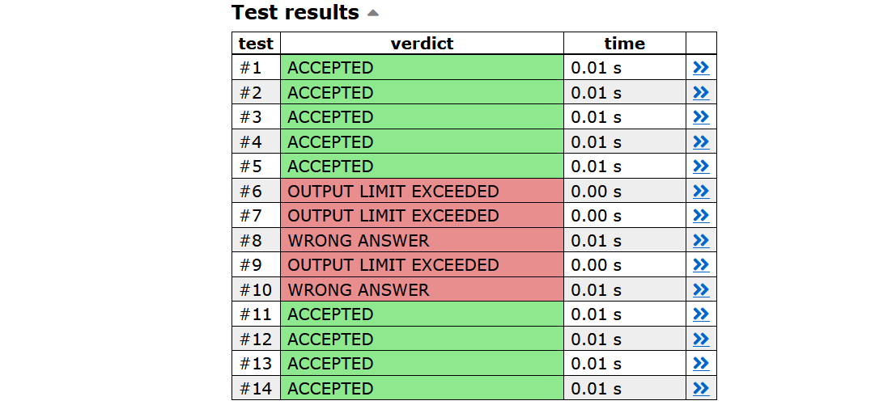
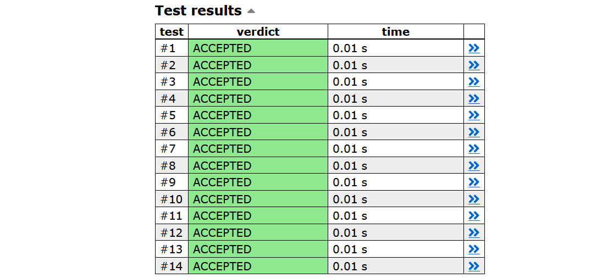

## O que é Competitive Programming?

A programação competitiva combina dois tópicos: o design de algoritmos e a implementação de algoritmos.

__Design de algoritmos__: O cerne da programação competitiva é inventar algoritmos eficientes que resolvam problemas computacionais bem definidos. O design de algoritmos requer habilidades matemáticas e de resolução de problemas. Muitas vezes, uma solução para um problema é uma combinação de métodos conhecidos e novos insights. A matemática desempenha um papel importante na programação competitiva. Na verdade, não há limites claros entre o design de algoritmos e a matemática.

__Implementação de algoritmos__: Na programação competitiva, as soluções dos problemas são avaliadas testando um algoritmo implementado usando um conjunto de casos de teste (test case). Assim, depois de chegar a um algoritmo que resolva o problema, o próximo passo é implementá-lo corretamente, o que requer boas habilidades de programação. A programação competitiva difere muito da engenharia de software tradicional: os programas são curtos (geralmente no máximo algumas centenas de linhas), devem ser escritos rapidamente e não é necessário mantê-los após o concurso.

No momento, as linguagens de programação mais populares usadas em concursos são C++, Python e Java. Por exemplo, no Google Code Jam 2019, entre os 4.500 melhores participantes, 71% usaram C++, 21% usaram Python e 8% usaram Java. Muitas pessoas consideram C++ a melhor escolha para um programador competitivo. C++ tem como vantagem ser uma linguagem muito eficiente e sua biblioteca padrão contém uma grande coleção de estruturas de dados e algoritmos.

## Concursos de programação

__IOI__: The *International Olympiad in Informatics* (Olimpíada Internacional de Informática) é um concurso anual de programação para alunos do ensino médio. Cada país pode enviar uma equipe de quatro alunos para o concurso. Geralmente há cerca de 300 participantes de 80 países. O IOI consiste em dois concursos de cinco horas de duração. Em ambos os concursos, os participantes são convidados a resolver três difíceis tarefas de programação. As tarefas são divididas em subtarefas, cada uma com uma pontuação atribuída. Enquanto os competidores são divididos em equipes, eles competem como indivíduos.

Os participantes do IOI são selecionados através de concursos nacionais. Antes do IOI, muitos concursos regionais são organizados, como a *Baltic Olympiad in Informatics* (BOI), a *Central European Olympiad in Informatics* (CEOI), a *Asia-Pacific Informatics Olympiad* (APIO) e a (OBI) *Olimpíada Brasiliera de Informática*.

__ICPC__: O *International Collegiate Programming Contest* é um concurso anual de programação para estudantes universitários. Cada equipe do concurso é composta por três alunos e, diferentemente do IOI, os alunos trabalham juntos, e apenas um computador está disponível para cada equipe.

O ICPC consiste em várias etapas e, finalmente, as melhores equipes são convidadas para as Finais Mundiais. Embora existam dezenas de milhares de participantes no concurso, há apenas um pequeno número de vagas finais disponíveis, portanto, mesmo avançar para as finais é uma grande conquista.
Em cada concurso ICPC, as equipes têm cinco horas para resolver cerca de dez problemas de algoritmos. Uma solução para problema só é aceita se resolver todos os casos de teste.

Durante a competição, os competidores podem ver os resultados de outras equipes, mas na última hora o placar fica congelado, não sendo possível ver os resultados das últimas submissões.

__CONCURSOS ONLINE__: Há também muitos concursos online que estão abertos para todos. No momento, o site de concursos mais ativo é o [*Codeforces*](https://codeforces.com/), que organiza concursos semanalmente. Outros sites populares de concursos incluem *AtCoder*, *CodeChef*, *CS Academy*, *HackerRank* e *Topcoder*.

Algumas empresas organizam concursos online com finais onsite. Exemplos de tais concursos são [*Facebook Hacker Cup*](https://www.facebook.com/codingcompetitions/hacker-cup), [*Google Code Jam*](https://codingcompetitions.withgoogle.com/codejam), [*Google Kick Start*](https://codingcompetitions.withgoogle.com/kickstart) e [*Yandex.Algorithm*](https://yandex.com/cup/algorithm/). É claro que as empresas também usam esses concursos para recrutamento: ter um bom desempenho em um concurso é uma boa maneira de provar suas habilidades em programação.

## Dicas para Praticar

Aprender programação competitiva requer uma grande quantidade de esforço e trabalho. No entanto, existem muitas maneiras de praticar, e algumas delas são melhores que outras. Ao resolver problemas, deve-se ter em mente que o número de problemas resolvidos não é tão importante quanto a qualidade dos problemas. É tentador selecionar problemas que parecem bons e fáceis e resolvê-los, e pular problemas que parecem difíceis e tediosos. No entanto, a maneira de realmente melhorar as habilidades é focar nos problemas difícies e tediosos.

Outra observação importante é que a maioria dos problemas de concursos de programação podem ser resolvidos usando algoritmos simples e curtos, mas a parte difícil é inventar o algoritmo. A programação competitiva não é aprender de cor algoritmos complexos e obscuros, mas sim aprender a resolver problemas e maneiras de abordar problemas difíceis usando ferramentas simples.

Finalmente, algumas pessoas desprezam a implementação de algoritmos: é divertido projetar algoritmos, mas é chato implementá-los. No entanto, a capacidade de implementar algoritmos de forma rápida e correta é um ativo importante, e essa habilidade pode ser praticada. É uma má ideia gastar a maior parte do tempo do concurso escrevendo código e encontrando bugs, em vez de pensar em como resolver problemas.

## CSES Problem Set

O [*CSES Problem Set*](https://cses.fi/problemset/list/) fornece uma coleção de problemas que podem ser usados para praticar programação competitiva. Os problemas foram organizados em ordem de dificuldade.

Vamos ver como resolver o primeiro problema no conjunto de problemas, chamado *Weird Algorithm*:
____

*Considere um algoritmo que recebe como entrada um inteiro positivo $n$. Se $n$ for par, o algoritmo o divide por dois, e se $n$ for ímpar, o algoritmo multiplica por três e soma um. O algoritmo repete isso, até que $n$ seja um. Por exemplo, a sequência para $n$ = 3 é a seguinte:*

$$3 → 10 → 5 → 16 → 8 → 4 → 2 → 1$$

Sua tarefa é simular a execução do algoritmo para um determinado valor de n.

__Input__: A única linha de entrada contém um inteiro $n$.

__Output__: Print uma linha que contenha todos os valores de $n$ durante o algoritmo.

__Restrições__: 

- $1 ≤ n ≤ 10^6$

__Exemplo__: 

Input: 

3

Output:

3 10 5 16 8 4 2 1
____

Este problema está ligado à famosa [*conjectura de Collatz*](https://pt.wikipedia.org/wiki/Conjectura_de_Collatz) que afirma que o algoritmo acima termina para todo valor de $n$. No entanto, ninguém foi capaz de provar isso. Neste problema, porém, sabemos que o valor inicial de $n$ será no máximo um milhão, o que torna o problema muito mais fácil de resolver.

Aqui está uma maneira possível de resolver o problema em C++:

```c++
#include<iostream>
using namespace std;

int main()
{
  int n;
  c >> n;
  while (true) {
    cout << n << " ";
    if (n == 1) break;
    if (n%2 == 0) n /= 2;
    else n = n*3+1;
  }
  cout << "\n";
}
```
O programa primeiro lê o número de input $n$, depois simula o algoritmo e faz um print do valor de $n$ após cada etapa. É fácil testar se o algoritmo trata corretamente o caso de exemplo $n = 3$ dado na declaração do problema.

Agora é a hora de *enviar* o código para o CSES. Em seguida, o código será compilado e testado usando um conjunto de casos de teste. Para cada caso de teste, o CSES nos dirá se nosso código passou ou não, e também podemos examinar o input, o output esperado e o output produzido pelo nosso código.

Após testar nosso código, o CSES fornece o seguinte relatório:



Isso significa que nosso programa passou em alguns dos casos de teste (ACCEPTED), às vezes era muito lento (TIME LIMIT EXCEEDED) e também produzio uma saída incorreta ((WRONG ANSWER). O que é bastante surpreendente!

O primeiro caso de teste que falha tem $n = 138367$. Se testarmos nosso código localmente usando essa entrada, veremos que o código é realmente lento. Na verdade, nunca termina.

A razão pela qual nosso programa falha é que $n$ pode se tornar bastante grande durante a simulação. Em particular, pode se tornar maior que o limite superior de uma variável *int*. Para corrigir o problema, basta alterar nosso código para que o tipo de $n$ seja *long long*. Então teremos o resultado desejado:

```c++
#include<iostream>
using namespace std;

int main()
{
  long long n;
  c >> n;
  while (true) {
    cout << n << " ";
    if (n == 1) break;
    if (n%2 == 0) n /= 2;
    else n = n*3+1;
  }
  cout << "\n";
}
```


Como este exemplo mostra, mesmo algoritmos muito simples podem conter bugs sutis. A programação competitiva ensina como escrever algoritmos que realmente funcionam.