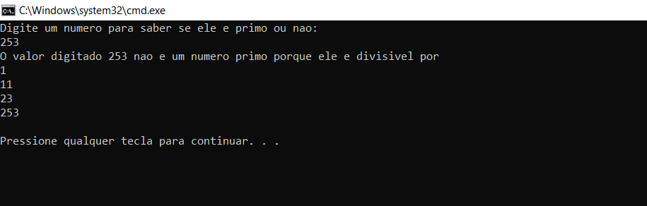

____



## O que são números primos ? 

- Um número primo é um número natural maior que 1, que só é divisível por 1 e por ele mesmo. Os primeiros números primos são: 2 3 5 7 11 13 17 19 23...

- Em outras palavras, o número primo é um número inteiro positivo maior que 1 que tem exatamente dois fatores, 1 e o próprio número.

- Tenha em mente que 1 não pode ser primo.

- Os números restantes, exceto 1, são classificados como números primos e compostos.

## Alguns fatos interessantes sobre os números primos:

- Com exceção de 2, que é o menor número primo e o único número primo par, todos os números primos são números ímpares.

- Todo número primo pode ser representado na forma de $6n + 1$ ou $6n – 1$, exceto os números primos 2 e 3, em que $n$ é um número natural

- Dois e três são apenas dois números naturais consecutivos que são primos.

- Todo número inteiro par maior que 2 pode ser expresso como a soma de dois primos conforme: [Goldbach's conjecture](https://en.wikipedia.org/wiki/Goldbach%27s_conjecture).

- A probabilidade de que um determinado número n escolhido aleatoriamente seja primo é inversamente proporcional ao seu número de dígitos, ou ao logaritmo de n: [Prime number theorem](https://en.wikipedia.org/wiki/Prime_number_theorem).
_____

## Como sabemos se um número é primo ou não?

Dado um inteiro positivo, verifique se o número é primo ou não. Um primo é um número natural maior que 1 que não possui divisores positivos além de 1 e ele mesmo. Exemplos dos primeiros números primos são {2, 3, 5, …}

Exemplo:

__Input__: $n$ = 11

__Output__: true

__Input__: $n$ = 15

__Output__: false

__Input__: $n$ = 1

__Output__: false

Agora vamos ver algums algoritmos de como descobrir se um número é primo ou não, começando pelo:

### School Method

Uma solução simples é percorrer todos os números de $2$ a $n-1$ e para cada número verificar se ele divide $n$. Se encontrarmos algum número que se divide, retornamos *false*.

Abaixo temos a implementação deste método em C++ e no Python3:

__C++__
```c++
// Um metódo em c++ usando o school method para sabermos se um número é primo
#include<bits/stdc++.h>
using namespace std;

bool prime(int n)
{
  // 1 não é primo
  if (n <= 1)
    return false;

  // Check de 2 até n - 1
  for (int i = 2; i < n; i++)
    if (n % i == 0)
        return false;

  return true;
}
// Exibindo o output da função acima
int main()
{
    prime(17) ? cout << " Verdadeiro\n" : cout << " Falso\n";
    prime(6) ? cout << " Verdadeiro\n" : cout << " Falso\n";
    return 0;
}
```
__Output__


____

__Python__
```python
# Um metódo em python usando o school method para sabermos se um número é primo
def prime(n):

  # 1 não é primo
  if ( n<= 1):
    return False

  # Check de 2 até n - 1
  for i in range(2, n):
    if n %  i == 0:
      return False

  return True
# Exibindo o output da função acima
print(" Verdadeiro") if prime(11) else print(" Falso")
print(" Verdadeiro") if prime(6) else print(" Falso")
```
__Output__
```python
Verdadeiro
Falso
```
_____
### School Method Otimizado: 

Podemos fazer as seguintes melhorias: Ao invés de checar até $n$, podemos checar até $\sqrt n$ porque um fator maior de $n$ deve ser um múltiplo de um fator menor que já foi checado. A implementação deste método é a seguinte:

__C++__
```c++
//  Um metódo otimizado em c++ usando o school method para sabermos se um número é primo
#include<bits/stdc++.h>
using namespace std;

bool prime(int n)
{
   // 1 não é primo
  if (n <= 1)
    return false;

  // Check de 2 até a raiz quadrada de n
  for (int i = 2; i <= sqrt(n); i++)
    if (n % i == 0)
      return false;
  
  return true;
}
// Exibindo o output da função acima
int main()
{
  prime(17) ? cout << " Verdadeiro\n" : cout << " Falso\n";
  prime(6) ? cout << " Verdaeiro\n" : cout << " Falso\n";
  return 0;
}
```
____
__Python__

```python
# Um metódo otimizado em python usando o school method para sabermos se um número é primo
# Importando a biblioteca math
import math

def prime(n):

  # 1 não é primo
  if ( n<= 1):
    return False

  # Check de 2 até a raiz quadrada de n
  for i in range(2, int(math.sqrt(n)) + 1):
    if (n % i == 0):
      return False

  return True

# Exibindo o output da função acima
print(" Verdadeiro") if prime(17) else print(" Falso")
print(" Verdadeiro") if prime(6) else print(" Falso")
```
__Output__

```python
Verdadeiro
Falso
```
____
### Temos um outro metódo: 

(Fonte: [Wikipedia](https://en.wikipedia.org/wiki/Primality_test#C,_C++,_C#_&_D))

Baseia-se no fato de que todos os primos maiores que $3$ são da forma $6k ± 1$, onde $k$ é qualquer inteiro maior que $0$. Isso ocorre porque todos os inteiros podem ser expressos como $(6k + i)$, no qual $i = −1, 0, 1, 2, 3$ ou $4$. E observe que $2$ divide $(6k + 0), (6k + 2)$ e $(6k + 4)$ e $3$ divide $(6k + 3)$. Assim, um método mais eficiente é testar se $n$ é divisível por $2$ ou $3$ e, em seguida, verificar todos os números da forma $6k ± 1 <= \sqrt n$. Isso é $3$ vezes mais rápido do que testar todos os números até $\sqrt n$.

__C++__

```c++
// Programa em c++ para sabermos se um número é primo ou não
#include <bits/stdc++.h>
using namespace std;
 
bool prime(int n)
{
    // Check se n=1 ou n=0
    if (n <= 1)
        return false;
    // Check se n=2 ou n=3
    if (n == 2 || n == 3)
        return true;
    // Check se n é divisivel por 2 ou 3
    if (n % 2 == 0 || n % 3 == 0)
        return false;
 
    // Check todos os números da forma 6k ± 1
    for (int i = 5; i * i <= n; i += 6) {
        if (n % i == 0 || n % (i + 2) == 0)
            return false;
    }
 
    return true;
}
 
// Exibindo o output da função acima
int main()
{
  prime(17) ? cout << " Verdadeiro\n" : cout << " Falso\n";
  prime(6) ? cout << " Verdaeiro\n" : cout << " Falso\n";
  return 0;
}
```
___
__Python__

```python
# Programa em python para sabermos se um número é primo ou não
import math

def prime(n):
	if n == 2 or n == 3:
		return True
	elif n <= 1 or n % 2 == 0 or n % 3 == 0:
		return False
	
	 # Check todos os números da forma 6k ± 1 
   # até que seja i <= a raiz quadrada de n, com valor final 6
	for i in range(5, int(math.sqrt(n))+1, 6):
		if n % i == 0 or n % (i+2) == 0:
			return False

	return True
# Exibindo o output da função acima
print(" Verdadeiro") if prime(17) else print(" Falso")
print(" Verdadeiro") if prime(6) else print(" Falso")
```
__Output__

```python
Verdadeiro
Falso
```
____
## Prática

*Para um determinado número __N__ verifique se ele é primo ou não. Um número primo é um número que só é divisível por 1 e por ele mesmo.*

Você não precisa colocar nenhum input ou fazer o print nada. Sua tarefa é completar a função __isPrime()__ que recebe um inteiro __N__ como parâmetro de input e retorna um inteiro 1 se N for um número primo ou 0 caso contrário.

__Exemplo__:

Input: 5

Output: 1

Explicação: 5 tem dois fatores 1 e 5

__Exemplo__:

Input: 25

Output: 0

Explicação: 25 tem três fatores 1, 5, 25

__Restrições__:

 - $1 ≤ N ≤ 10^9$
____

Resolva o problema e você pode enviar sua resposta no [GeeksforGeeks](https://practice.geeksforgeeks.org/problems/prime-number2314/1).
____

## Aprenda um programa em C para saber se um número é primo ou não 

Todo código é explicado logo abaixo. Se você não usa C, você pode tentar implementar o programa em C++ ou Python.

```c
#include<stdio.h>
int main(){

 int num, i, conte=0;
 printf("Digite um numero para saber se ele e primo ou nao: \n");
 scanf("%d", &num);
 for(i = 1; i <= num; i++)
 {
  if(num%i == 0)
  {
    conte++;
  }
 }
 if(conte==2)
 {
  printf("O valor digitado %d e um numero primo\n", num);
 }
 else
 {
  printf("O valor digitado %d nao e um numero primo porque ele e divisivel por\n", num);
  for(i = 1; i <= num; i++)
  {
    if (num%i == 0)
    {
      printf("%d\n", i);
    }
  }
 }
}
```
__Explicação__: *O número primo deve ser divisível por 1 e por ele mesmo. Este é o conceito principal deste programa.*

1. Começamos o programa declarando as variáveis:

- __num__ → Armazenar os *números*
- __i__ → Variável *temporária*
- __conte__ → Para armazenar os números dos *divisores*

2. Pegamos o número como input
```c
printf("Digite um numero para saber se ele e primo ou nao: \n");
scanf("%d", &num);
```
3. 

```c
 for(i = 1; i <= num; i++)
 {
  if(num%i == 0)
  {
    conte++;
  }
 }
```
Vamos supor __num=253__. O loop irá percorrer de i=1 a 253 e em cada iteração o número num=253 é dividido por i. Por exemplo:

- __Iteração 1__: i=1, i menor que 253
- Em *if num%i==0, 253%1==0*, o que é verdade
- Em seguida, conte é incrementado com 1. Então, conte = 1;

- __Iteração 2__: i=2, i menor que 253
- Em *if num%i==0, 253%2==0*, o que é falso
- Como a condição é falsa *conte continua o mesmo*, assim conte = 1;

- __Iteração 3__: i=3, i menor que 253
- Em *if num%i==0, 253%3==0*, o que é falso
- Como a condição é falsa *conte continua o mesmo*, assim conte = 1;

O programa continua assim até a *iteração 11*

- __Iteração 11__: i=11, i menor que 253 
- Em *if num%i==0, 253%11==0*, o que é verdadeiro
- Em seguida, conte é incrementado com 1. Então, conte = 2;

O programa continuará assim para cada divisor do número (253), *conte* será incrementado e neste caso existem 4 divisores ( 1, 11, 23, 253 ) até que i=253

- Assim, conte = 4;

4. 

```c
 if(conte==2)
 {
  printf("O valor digitado %d e um numero primo\n", num);
 }
 else
 {
  printf("O valor digitado %d nao e um numero primo porque ele e divisivel por\n", num);
  for(i = 1; i <= num; i++)
  {
    if (num%i == 0)
    {
      printf("%d\n", i);
    }
  }
 }
```
Quanto ao número primo haverá apenas 2 divisores: 1 e o próprio número; se o número for primo, *conte será 2* ou seja (conte = 2). Mas neste caso em que o número é 253, temos que (conte = 4) então a condição será __falsa__ e será feito o print que o número não é primo, assim, o programa exibirá seus divisores usando a mesma lógica que no caso de contar o número de divisores, exceto em vez de usar *conte* para incrementar usamos __printf__ para fazer o print dos valores dos divisores.

__Output__


____