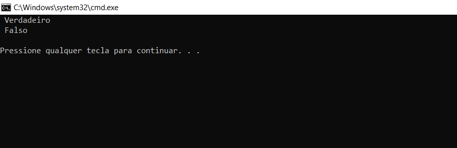

- Nesta série de artigos descreveremos métodos, algoritmos e problemas para definir se um número é primo ou não.
____

Dado um inteiro positivo, verifique se o número é primo ou não. Um primo é um número natural maior que 1 que não possui divisores positivos além de 1 e ele mesmo. Exemplos dos primeiros números primos são {2, 3, 5, …}

Exemplo:

__Input__: $n$ = 11

__Output__: true

__Input__: $n$ = 15

__Output__: false

__Input__: $n$ = 1

__Output__: false

Agora vamos ver algums algoritmos de como descobrir se um número é primo ou não, começando pelo:

### School Method

Uma solução simples é percorrer todos os números de $2$ a $n-1$ e para cada número verificar se ele divide $n$. Se encontrarmos algum número que se divide, retornamos *false*.

Abaixo temos a implementação deste método em C++ e no Python3:

__C++__
```c++
// Um metódo em c++ usando o school method para sabermos se um número é primo
#include<bits/stdc++.h>
using namespace std;

bool prime(int n)
{
  // Check de 2 até n - 1
  for (int i = 2; i < n; i++)
    if (n % i == 0)
        return false;

  return true;
}
// Exibindo o output da função acima
int main()
{
    prime(17) ? cout << " Verdadeiro\n" : cout << " Falso\n";
    prime(6) ? cout << " Verdadeiro\n" : cout << " Falso\n";
    return 0;
}
```
__Output__


____

__Python__
```python
# Um metódo em python usando o school method para sabermos se um número é primo
def prime(n):
  
  # Check de 2 até n - 1
  for i in range(2, n):
    if n %  i == 0:
      return False

  return True
# Exibindo o output da função acima
print(" Verdadeiro") if prime(11) else print(" Falso")
print(" Verdadeiro") if prime(6) else print(" Falso")
```
__Output__
```python
Verdadeiro
Falso
```
_____
### School Method Otimizado: 

Podemos fazer as seguintes melhorias: Ao invés de checar até $n$, podemos checar até $\sqrt n$ porque um fator maior de $n$ deve ser um múltiplo de um fator menor que já foi checado. A implementação deste método é a seguinte:

__C++__
```c++
//  Um metódo otimizado em c++ usando o school method para sabermos se um número é primo
#include<bits/stdc++.h>
using namespace std;

bool prime(int n)
{
  // Check de 2 até a raiz quadrada de n
  for (int i = 2; i <= sqrt(n); i++)
    if (n % i == 0)
      return false;
  
  return true;
}
// Exibindo o output da função acima
int main()
{
  prime(17) ? cout << " Verdadeiro\n" : cout << " Falso\n";
  prime(6) ? cout << " Verdaeiro\n" : cout << " Falso\n";
  return 0;
}
```
____
__Python__

```python
# Um metódo otimizado em python usando o school method para sabermos se um número é primo
# Importando a biblioteca math
import math

def prime(n):

  # Check de 2 até a raiz quadrada de n
  for i in range(2, int(math.sqrt(n)) + 1):
    if (n % i == 0):
      return False

  return True

# Exibindo o output da função acima
print(" Verdadeiro") if prime(17) else print(" Falso")
print(" Verdadeiro") if prime(6) else print(" Falso")
```
__Output__

```python
Verdadeiro
Falso
```
____
### Temos um outro metódo: 

(Fonte: [Wikipedia](https://en.wikipedia.org/wiki/Primality_test#C,_C++,_C#_&_D))

Baseia-se no fato de que todos os primos maiores que $3$ são da forma $6k ± 1$, onde $k$ é qualquer inteiro maior que $0$. Isso ocorre porque todos os inteiros podem ser expressos como $(6k + i)$, no qual $i = −1, 0, 1, 2, 3$ ou $4$. E observe que $2$ divide $(6k + 0), (6k + 2)$ e $(6k + 4)$ e $3$ divide $(6k + 3)$. Assim, um método mais eficiente é testar se $n$ é divisível por $2$ ou $3$ e, em seguida, verificar todos os números da forma $6k ± 1 <= \sqrt n$. Isso é $3$ vezes mais rápido do que testar todos os números até $\sqrt n$.

__C++__

```c++
// Programa em c++ para sabermos se um número é primo ou não
#include <bits/stdc++.h>
using namespace std;
 
bool prime(int n)
{
    if (n == 2 || n == 3)
        return true;
 
    if (n <= 1 || n % 2 == 0 || n % 3 == 0)
        return false;
 
    // Check todos os números da forma 6k ± 1
    for (int i = 5; i * i <= n; i += 6) {
        if (n % i == 0 || n % (i + 2) == 0)
            return false;
    }
 
    return true;
}
 
// Exibindo o output da função acima
int main()
{
  prime(17) ? cout << " Verdadeiro\n" : cout << " Falso\n";
  prime(6) ? cout << " Verdaeiro\n" : cout << " Falso\n";
  return 0;
}
```
___
__Python__

```python
# Programa em python para sabermos se um número é primo ou não
import math

def prime(n):
	if n == 2 or n == 3:
		return True
	elif n <= 1 or n % 2 == 0 or n % 3 == 0:
		return False
	
	 # Check todos os números da forma 6k ± 1 
   # até que seja i <= a raiz quadrada de n, com valor final 6
	for i in range(5, int(math.sqrt(n))+1, 6):
		if n % i == 0 or n % (i+2) == 0:
			return False

	return True
# Exibindo o output da função acima
print(" Verdadeiro") if prime(17) else print(" Falso")
print(" Verdadeiro") if prime(6) else print(" Falso")
```
__Output__

```python
Verdadeiro
Falso
```
____
## Prática

*Para um determinado número __N__ verifique se ele é primo ou não. Um número primo é um número que só é divisível por 1 e por ele mesmo.*

Você não precisa colocar nenhum input ou fazer o print nada. Sua tarefa é completar a função __isPrime()__ que recebe um inteiro __N__ como parâmetro de input e retorna um inteiro 1 se N for um número primo ou 0 caso contrário.

__Exemplo__:

Input: 5

Output: 1

Explicação: 5 tem dois fatores 1 e 5

__Exemplo__:

Input: 25

Output: 0

Explicação: 25 tem três fatores 1, 5, 25

__Restrições__:

 - $1 ≤ N ≤ 10^9$
____

