

## Introdução ao Data Types em C++

O artigo a seguir fornece uma estrutura de tópicos para os data types em C++. Veremos diferentes data types como __integer__, __float__, __double__, __char__ e build-in data types como __union__, __enum__, __struct__ e data types como __functions__, __pointers__, __arrays__. Os data types devem ser definidos antes da execução, pois eles informam ao compilador o data type que as variáveis específicas mantêm. Por exemplo, o data type do tipo __integer__ pode conter apenas valores inteiros, não pode conter valores __float__ ou valores de __string__.

Um data type serve para informar a variável que tipo de elemento ela é e definitivamente vai determinar a alocação de memória dessa variável. Sabemos que cade data type possui uma alocação de memória diferente. No C++ existem três data types diferentes, a saber: __Primitive__, __Derived__ e __User Defined__.
 
___

### 1. Primitive Data Types

Eles são predefinidos no c++, também podemos chamados de __build-in__ data types. Usamos eles diretamente para declarar as variáveis.

- __Integer__: Usualmente definido como "***int***". Podemos saber o tamanho da memória alocada e como a variável é declarada logo abaixo.

```c++
#include<iostream>
using namespace std;

int main()
{
  int a;
  cout << "O tamanho de int : " << sizeof(a);
}
```
Output: 

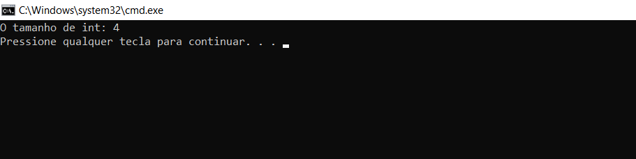
___

- __Character__: Usualmente definido com "***char***". O tamanho da memória alocada e como a variável é declarada segue logo abaixo.

```c++
#include<iostream>
using namespace std;

int main()
{
  char a;
  a = 'M';
  cout << "O tamanho de char: " << sizeof(a) << endl;
  cout << "O valor de a: " << a;
}
```
Output:

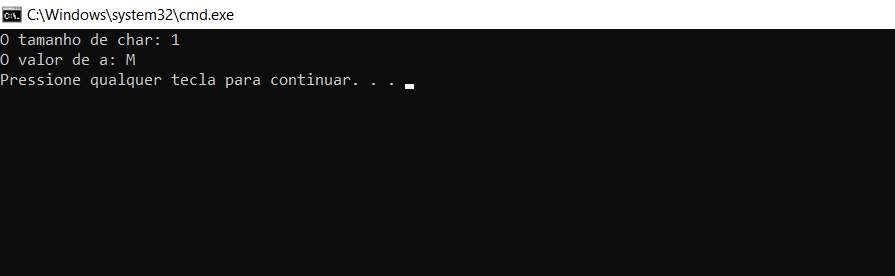
___

- __Floating Point__: Usualmente definido como "***float***".  O tamanho da memória alocada e como a variável é declarada segue logo abaixo.

```c++
#include<iostream>
using namespace std;

int main()
{
  float a;
  a = 3.14;
  cout << "O tamanho de float: " << sizeof(a) << endl;
  cout << "O valor de a: " << a;
}
```
Output:

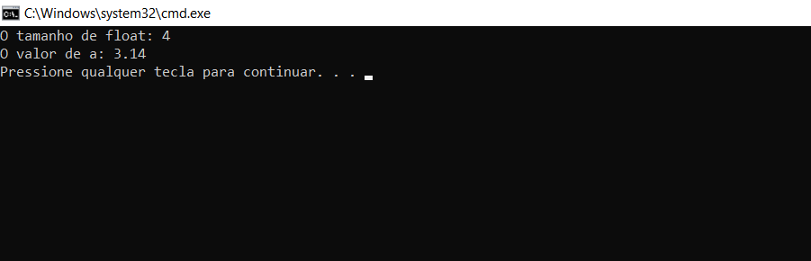

___

- __Boolean__: Usualmente definido como "***bool***". A memória alocada e como a variável é declarada vemos logo abaixo:

```c++
#include<iostream>
using namespace std;

int main()
{
  bool a;
  cout << "O tamanho do bool:" << sizeof(a) << endl;
  cout << "O valor de a: " << a;
}
```
Output:

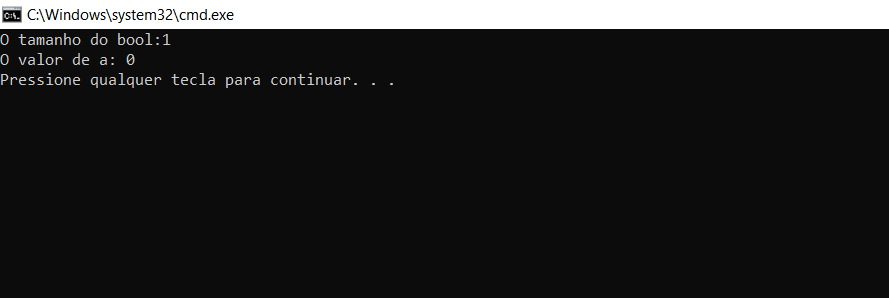
___

- __String__: Usualmente usado com "***string***". A memória alocada e como a variável é declarada vemos logo abaixo:

```c++
#include<iostream>
using namespace std;

int main()
{
 string a;
 a = "C++";
 cout << "O tamanho de string: " << sizeof(a) << endl;
 cout << "O valor de a: " << a;
}
```
Output:

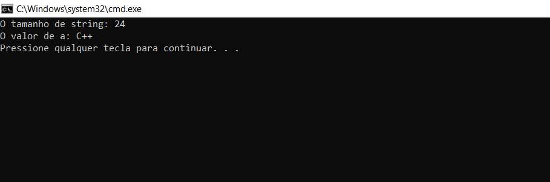

___

Com isso, também temos o conceito de __signed__, __unsigned__, __short__ e __long__. Então, o que eles significam? Eles são chamados de modificadores de data type. Estes, de fato, decidem o comprimento real de qualquer data type específico.

Valores __signed__ nos dão valores abaixo e acima de zero, que são ambos positvos e negativos.
Enquanto os valores __unsigned__ contêm dados que são apenas positivos.
Sobre __short__ e __long__, através dos próprios nomes podemos interpretar claramente que o modificador __long__ tem a capacidade de armazenar grandes quantidades de dados. E, de fato, __short__ é um data type que deve conter o mínimo desses valores.

___

### 2. Derived Data Types

Esses data types são derivados dos primitive data types o que justifica seu nome.

- __Array__: Vamos definir uma série. Vejamos como podemos fazer isso:

```c++
#include<iostream>
using namespace std;

int main()
{
 int a[10] = {1, 1, 2, 3, 5, 8, 13, 21, 34};
 cout << "O tamanho do array: " << sizeof(a) << endl;
 for(int i=0; i<10; i++)
 {
  cout << "O valor de a: " << a[i] << endl;
 }
}
```
Output:

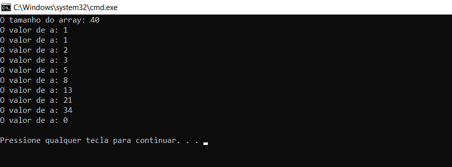

___

- __Pointer__: Eles permitem a funcionalidade de chamada por referência e desempenham um papel importante na declaração ou manipulação de dados em estruturas de dados dinâmicas. Por exemplo, na criação de Stacks, Queues e Linked Lists usamos principalmente esses pointers.

```c++
#include<iostream>
using namespace std;

int main()
{
 float a = 30;
 float *h;
 h = &a;
 cout << "O valor do pointer h: " << h << endl;
 cout << "O valor da variavel a: " << a << endl;
 cout << "O valor de h: " << *h;
}
```
Output:

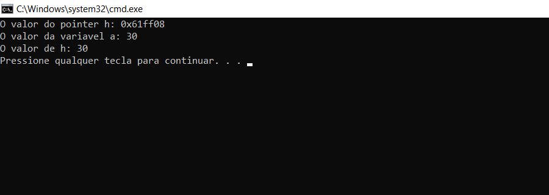

___

### 3. User-Defined Data Types

Como o nome já sugere, esses são os data types que o usuário pode definir. Vejamos alguns exemplos.

- __Structures__: Pode armazenar a combinação de data types semelhantes ou diferentes em locais de memória contínuos. Como já vimos, em arrays podemos armazenar apenas itens com data types semelhantes. Mas com as structures podemos armazenar diferentes tipos de dados.

```c++
#include<iostream>
using namespace std;
struct First
{
  int a = 58;
  string r = "Aprendendo data types";
  float y = 25.6;
};


int main()
{
 struct First f;
 cout << "O valor integer: " << f.a << endl;
 cout << "O valor string: " << f.r << endl;
 cout << "O valor float: " << f.y;
}
```
Output:

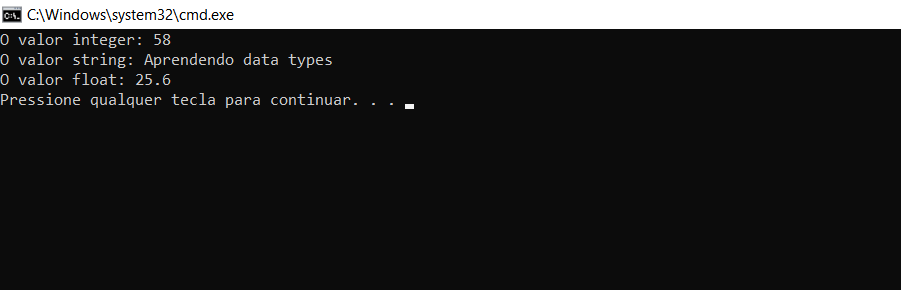

___

- __Class__: É definido em programação orientada a objetos. Ele possui funções, variáveis e é acessado criando objetos.

```c++
#include<iostream>
using namespace std;

class First
{
  public:
  string nome;
  void show()
  {
    cout << "Nome: " << nome;
  }
};

int main()
{
  First f;
  f.nome = "C++";
  f.show();
  return 0;
}
```
Output:

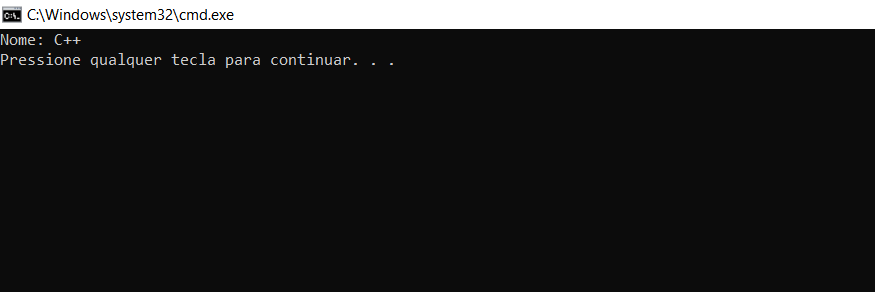

___

- __Type Def__: Usamos este data type para dar um nome *novo* ou *diferente* aos data types.

```c++
#include<iostream>
using namespace std;

int main()
{
  typedef unsigned char Este;
  typedef unsigned int Aquele;

  Este a1;
  Aquele a2;

  a1 = 'M';
  a2 = 25;

  cout << "Olhe bem: " << a1 << endl;
  cout << "Olhe de novo: " << a2 << endl;
  return 0;
}
```
Output:

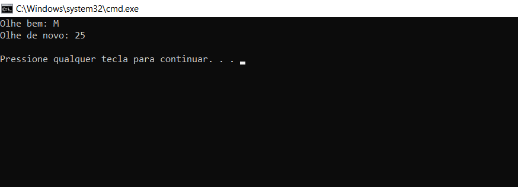

___

- __Enumeration__: Definido pela palavra “***enum***”. Geralmente são usados quando já conhecemos um conjunto de valores para uma determinada variável e escolhemos um único valor para ela.

```c++
#include<iostream>
using namespace std;

enum color {Amarelho, Vermelho, Verde, Azul}col;
int main()
{
  col = Verde;
  cout << "A color escolhida esta na coluna: " << col;
  return 0;
}
```
Output:

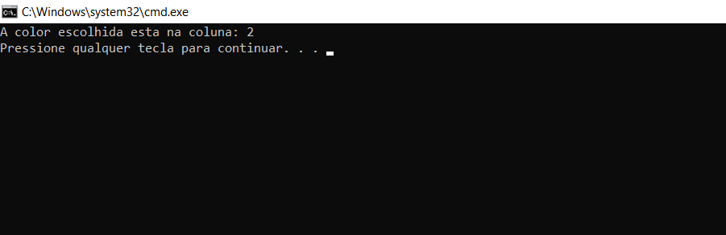

## Conclusão

Você aprendeu vários data types em C++, definitivamente, eles são a base de qualquer linguagem de programação. Sem declarar variáveis com data types ou tipos de dados específicos, não podemos saber as alocações exatas de memória e qual conjunto de instruções um programa deve fazer. Pratique e tente usar diferentes tipos de dados com modificadores e verifique como eles se comportão de máneiras diferentes.
