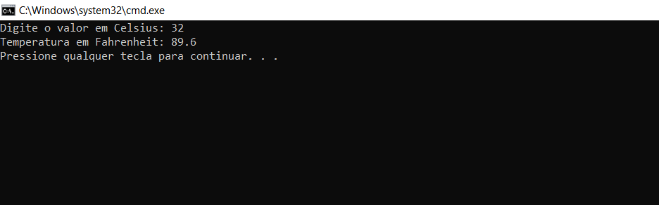
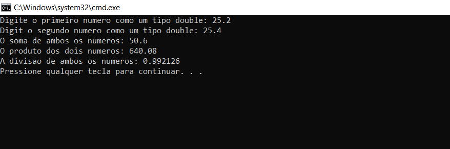

### Sintaxe

O data type __double__ no C++ tem um sintaxe que é representada do seguinte forma:

```c++
double var_nome;
```
Além disso, um série var_nome pode ser considerada para melhor otimizar a representação do programa:

```c++
double var_nome1, var_nome2, var_nome3 ... var_nomeN;
```
### Como o data type double funciona no C++ ?

- O double no C++ tem um padrão de trabalho interessante que é usado e escolhido pela maioria dos programadores.

- O data type double pode acomodar principalmente os valores que variam de 15 a 16 dígitos isto é, um data type de 64-bits do tipo floating point portanto, pode ser organizado em um formato quando declarado e inicializado com valores decimais, conforme mencionado.
 
## Exemplos

### 1. Exemplo

Este programa demonstra o uso da key-word double na qual o usuário deseja fazer uma conversão de temperatura Celsius para Fahrenheit conforme mostrado no output:

```c++
#include<iostream>
using namespace std;

int main()
{
  double c_temp, f_temp;
  cout << "Digite o valor em Celsius: "; 
  cin >> c_temp;
  f_temp = (c_temp * 1.8) + 32; // para que você consiga converter de grau Celsius para Fahrenheit, basta multiplicar a temperatura em graus Celsius por 1.8 e somar 32.
  cout << "Temperatura em Fahrenheit: " << f_temp;
  return 0;
}
```
Output:


____

### 2. Exemplo

Este programa demonstra a adição, multiplicação e divisão de dois números e fornece o output no qual ambos os números de input serão do tipo double:

```c++
#include<iostream>
using namespace std;

int main()
{
 double n_1, n_2;
 cout << "Digite o primeiro numero como um tipo double: ";
 cin >> n_1;
 cout << "Digit o segundo numero como um tipo double: ";
 cin >> n_2;
 cout << "O soma de ambos os numeros: " << (n_1 + n_2);
 cout << "\nO produto dos dois numeros: " << (n_1 * n_2);
 cout << "\nA divisao de ambos os numeros: " << (n_1 / n_2);
 return 0;
}
```
Output:


____

### 3. Exemplo

Este programa demonstra function overloading em que a função que considera dois números inteiros é substituída pela função que consiste no tipo de dados com ambos os parâmetros como double, conforme mostrado no output:

```c++
#include<iostream>
using namespace std;

int sum_sum(int, int);
double sum_sum(double, double);

int main()
{
    int n_1, n_2, p;
    double n_3, n_4, q;
    cout << "Dois numeros inteiros: ";
    cin >> n_1 >> n_2;
    cout << "Resultado: " << sum_sum(n_1, n_2) << endl;
    cout << "Dois numeros double: ";
    cin >> n_3 >> n_4;
    cout << "Resultado: " << sum_sum(n_3, n_4) << endl;
}
int sum_sum(int p, int q)
{
    return p+q;
}
double sum_sum(double p, double q)
{
    return p+q;
}
```